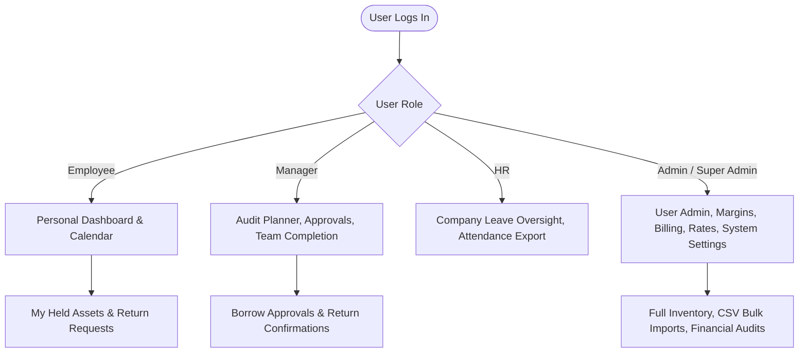
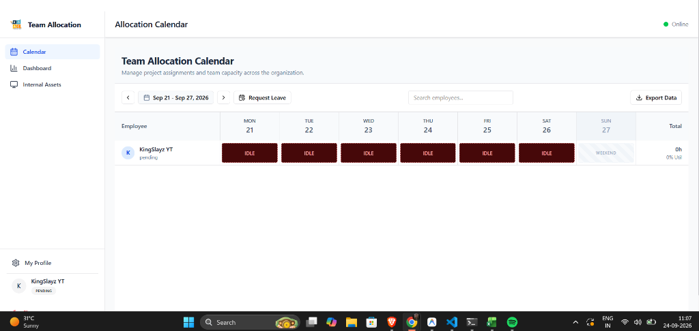
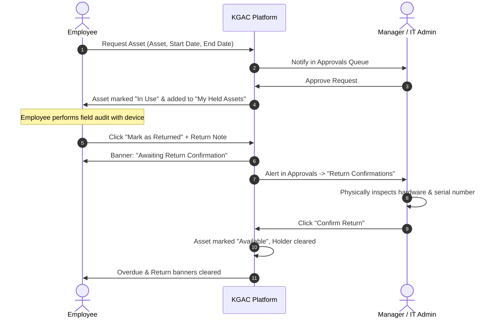
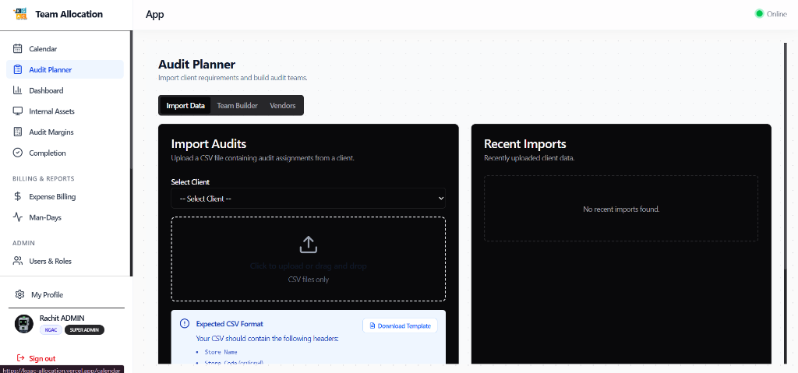
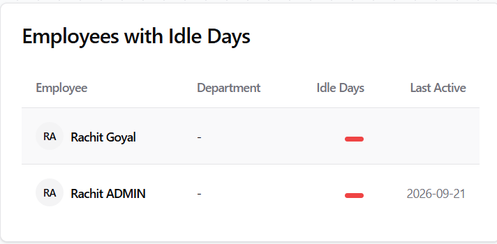
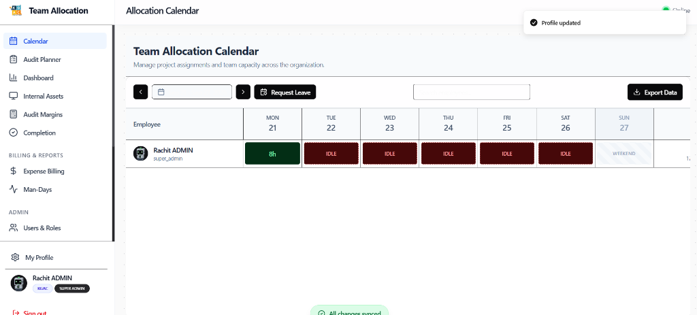

# KGAC Team Allocation & Audit Operations Platform
## Complete User Walkthrough Guide & Operating Manual

> [!NOTE]
> This guide is designed for all team members across **KGAC** and **KPL**. Whether you are a field auditor logging daily hours, a manager coordinating audit schedules, an HR specialist managing attendance, or a system administrator, this manual outlines your exact responsibilities, step-by-step workflows, and platform features.

---

## Table of Contents
1. [Platform Overview & User Roles Matrix](#1-platform-overview--user-roles-matrix)
2. [Getting Started: Login, Onboarding & Security](#2-getting-started-login-onboarding--security)
3. [Tier 1: Regular Employees & Field Auditors](#3-tier-1-regular-employees--field-auditors)
   - [3.1 Personal Dashboard & Upcoming Audits](#31-personal-dashboard--upcoming-audits)
   - [3.2 Allocation Calendar & Daily Work Logging](#32-allocation-calendar--daily-work-logging)
   - [3.3 Leave & PTO Requests](#33-leave--pto-requests)
   - [3.4 Equipment Checkout & Return Workflow](#34-equipment-checkout--return-workflow)
4. [Tier 2: Managers & Audit Leads](#4-tier-2-managers--audit-leads)
   - [4.1 Audit Planner & Team Scheduling](#41-audit-planner--team-scheduling)
   - [4.2 Reviewing & Approving Leave Requests](#42-reviewing--approving-leave-requests)
   - [4.3 Asset Approvals & Return Verifications](#43-asset-approvals--return-verifications)
   - [4.4 Timesheet Completion & Mismatch Monitoring](#44-timesheet-completion--mismatch-monitoring)
   - [4.5 Department Reports & Data Exports](#45-department-reports--data-exports)
5. [Tier 3: Human Resources (HR)](#5-tier-3-human-resources-hr)
   - [5.1 Organization-wide Leave & Absence Oversight](#51-organization-wide-leave--absence-oversight)
   - [5.2 Attendance & Payroll Reporting (CSV & Excel)](#52-attendance--payroll-reporting-csv--excel)
   - [5.3 Company Equipment Compliance](#53-company-equipment-compliance)
6. [Tier 4: Administrators & Super Admins](#6-tier-4-administrators--super-admins)
   - [6.1 User Onboarding, Approvals & Role Assignments](#61-user-onboarding-approvals--role-assignments)
   - [6.2 Department & Client Management](#62-department--client-management)
   - [6.3 Vendor Rates & External Contractor Pricing](#63-vendor-rates--external-contractor-pricing)
   - [6.4 Audit Margins & Financial Reconciliation](#64-audit-margins--financial-reconciliation)
   - [6.5 Inventory Directory & Asset Management](#65-inventory-directory--asset-management)
   - [6.6 Database Maintenance & Audit Trails](#66-database-maintenance--audit-trails)
7. [Universal Data Export Guide (CSV & Excel)](#7-universal-data-export-guide-csv--excel)
8. [Frequently Asked Questions & Troubleshooting](#8-frequently-asked-questions--troubleshooting)

---

## 1. Platform Overview & User Roles Matrix

The KGAC Platform coordinates field audit staffing, daily time allocations, inventory tracking, financial margins, and compliance across all business entities (**KGAC** and **KPL**).

### Role & Responsibilities Matrix

| Feature / Module | Employee / Auditor | Manager / Audit Lead | Human Resources (HR) | Admin / Super Admin |
| :--- | :---: | :---: | :---: | :---: |
| **Personal Dashboard & Assigned Audits** | ✅ View own | ✅ View own | ✅ View own | ✅ View all |
| **Daily Calendar Allocation** | ✅ Log own hours | ✅ Plan & allocate team | ✅ View all | ✅ Full edit access |
| **Leave / PTO Submissions** | ✅ Submit own | ✅ Submit own | ✅ Submit own | ✅ Submit own |
| **Leave Approvals** | ❌ No | ✅ Department team | ✅ All employees | ✅ All employees |
| **Internal Assets: Checkout** | ✅ Request gear | ✅ Request gear | ✅ Request gear | ✅ Request gear |
| **Internal Assets: Return** | ✅ Mark returned | ✅ Mark returned | ✅ Mark returned | ✅ Mark returned |
| **Internal Assets: Approvals** | ❌ No | ✅ Department team | ✅ All employees | ✅ All employees |
| **Internal Assets: History & Reports**| ❌ No | ✅ Department team | ✅ All employees | ✅ All employees |
| **Audit Planner (CSV Client Import)**| ❌ No | ✅ Build teams | ❌ No | ✅ Full access |
| **Timesheet Completion Tab** | ❌ No | ✅ Monitor team | ✅ Company overview | ✅ Full access |
| **Attendance Export (CSV & Excel)** | ✅ Own records | ✅ Department team | ✅ All employees | ✅ All employees |
| **Audit Margins & Expense Billing** | ❌ No | ❌ No | ❌ No | ✅ Full access |
| **User Onboarding & Role Assignment**| ❌ No | ❌ No | ❌ No | ✅ Full access |
| **Client & Vendor Rate Management** | ❌ No | ❌ No | ❌ No | ✅ Full access |

---

## 2. Getting Started: Login, Onboarding & Security

### 2.1 Logging In
1. Open the platform in Google Chrome or Microsoft Edge: `https://kgac-allocation.vercel.app` (or your internal intranet link).
2. Enter your assigned **Username** (e.g., `rahul.sharma` or `employee_id`) and **Password**.
   > [!NOTE]
   > You do not need to type `@kgac-users.com`. The platform automatically authenticates internal usernames seamlessly.
3. Click **Sign In**.

### 2.2 First-Time Account Registration
If you are a new team member who hasn't been provisioned:
1. Click **"Don't have an account? Sign up"** below the login box.
2. Enter your Full Name, desired Username, Phone Number, and a secure password.
3. Upon registration, your account enters **Pending Approval** status.
4. An Administrator will review your account, assign your Department (e.g. *Audit*, *Accounts*, *IT*), and approve your access.

### 2.3 Entity Selection (KGAC vs KPL)
When logging in for the first time after approval, you may be prompted to select your operational legal entity:
- **KGAC** (K.G. Associates & Consultants)
- **KPL** (KGAC Private Limited)
Select your official employment entity and click **Confirm**. This ensures your timesheets and client billings route to the correct company books.

### 2.4 Profile Management & Changing Your Password
1. Click **My Profile** at the bottom of the left sidebar.
2. In the profile screen, you can:
   - Verify your assigned roles, entity, and department.
   - Update your **Full Name** or **Phone Number**.
   - Change your account **Password**.
3. Click **Save Changes** to commit updates.

---

## 3. Tier 1: Regular Employees & Field Auditors

As a field auditor or team associate, your primary daily responsibilities are:
1. Checking your upcoming audit dates and locations.
2. Logging accurate daily working hours and task progress.
3. Requesting necessary audit equipment (HHT scanners, laptops) and returning them promptly.
4. Submitting leave requests in advance.

### 3.1 Personal Dashboard & Upcoming Audits
When you open **Dashboard** from the sidebar:
- **Upcoming Audits Card:** Displays every client audit you are assigned to, including Client Name, Store Location, Scheduled Date, and your assigned role (e.g., *Lead Auditor* or *Audit Assistant*).
- **Overdue Asset Warning (Red Card):** If you are holding any company equipment past its scheduled return date, a red card will remind you to return the item to the IT desk.
- **Awaiting Return Confirmation (Amber Card):** When you submit an asset return, this card shows that your handover is in progress awaiting manager verification.

### 3.2 Allocation Calendar & Daily Work Logging
Click **Calendar** in the sidebar to view your weekly allocation grid.

#### Color Legend:
- 🟩 **Green (Billable):** Hours logged on a billable client project or audit.
- 🟪 **Purple (Internal):** Internal office tasks, training, or non-billable assignments.
- 🟥 **Red Pattern (Idle):** No hours logged on a scheduled working day.
- ⬜ **Gray (PTO / Holiday):** Approved leave or gazetted public holiday.
- 🟦 **Striped (Weekend):** Saturday / Sunday non-working days.

#### How to Log Your Hours:
1. Find your row on the calendar grid.
2. Click on the cell corresponding to today's date.
3. In the allocation popup:
   - Select the **Project / Client Store** you worked on.
   - Enter your **Hours** (standard full day is `8.0h`).
   - Select the **Status** (*Billable* or *Internal*).
   - Update your **Task Progress** (*Not Started*, *In Progress*, *Completed*, or *Blocked*).
   - Enter any **Notes** (e.g., *"Completed inventory count for Aisles 1 to 14"*).
4. Click **Save**. The grid updates immediately and syncs to the server.

> [!TIP]
> **Copy Previous Week:** If your work schedule is identical to the previous week, click the **Copy Week** shortcut on your row to copy all project allocations across the current weekdays in one click!

### 3.3 Leave & PTO Requests
1. On the Calendar page, click the **Request Leave** button in the top toolbar.
2. Select your **Leave Type**:
   - *Paid Time Off (PTO / Vacation)*
   - *Sick Leave*
   - *Unpaid Leave*
3. Select your **Start Date** and **End Date**.
4. Enter a brief reason in the **Notes** box.
5. Click **Submit Request**.
   - Your request is automatically routed to your department manager.
   - Once approved, the days automatically show as PTO on the allocation grid.

---

### 3.4 Equipment Checkout & Return Workflow

Audits frequently require company-owned hardware such as Handheld Terminals (HHTs), Barcode Scanners, Laptops, or Mobile Devices.

#### Step 1: Requesting an Asset
1. Go to **Internal Assets** → click the **My Requests** tab.
2. Under **New Request**:
   - Choose the device from the **Select Available Asset** dropdown.
   - Pick your **Start Date** and **End Date** (the date you will return it).
   - Click **Submit Request**.

#### Step 2: Viewing Your Equipment in "My Held Assets"
1. Click the **My Held Assets** tab.
2. You will see every piece of hardware currently checked out to your name, including:
   - Device Name & Equipment Type icon.
   - Serial Number / Tag (e.g. `HHT-BLR-042`).
   - Assigned checkout period and scheduled due date.
   - Live status badge: **Active** (green) or **Overdue** (red).

#### Step 3: Returning Equipment
1. When you physically hand the hardware back to the IT cabinet or your manager:
2. Open **Internal Assets** → **My Held Assets**.
3. Click the **Mark as Returned** button on the device card.
4. In the dialog, optionally add a note (e.g., *"Returned to IT desk floor 2, charger and cable included, device working properly"*).
5. Click **Submit Return**.
6. The card immediately updates to an amber **Return Pending** badge, and an **Awaiting Return Confirmation** banner appears on your dashboard until your manager confirms receipt.

---

## 4. Tier 2: Manager & Audit Lead Guide

Managers and Audit Leads are responsible for staffing audits, balancing team capacity, approving leaves, verifying hardware returns, and monitoring timesheet completion.

### 4.1 Audit Planner & Team Scheduling
Navigate to **Audit Planner** in the sidebar:
1. **Import Client Audits:**
   - Select your Client (e.g. *Reliance Retail*, *Tata Croma*, *DMart*).
   - Drag and drop the client's scheduling spreadsheet (CSV) containing Store Names, Store Codes, Audit Dates, and City/Zone.
   - The system parses the upload and creates pending audit entries.
2. **Team Builder:**
   - Click the **Team Builder** tab.
   - For each scheduled store audit:
     - Assign the **Lead Auditor** (Senior).
     - Assign **Field Assistants / Associates**.
     - Assign external vendor resources if required.
   - The system checks auditor schedules to prevent double-booking.
3. Once assigned, audits automatically populate in team members' personal Dashboards and the Allocation Calendar!

### 4.2 Reviewing & Approving Leave Requests
1. Open the **Approvals** or **Calendar** section.
2. Filter for pending leave requests.
3. Review the employee's request dates and reasoning against project staffing needs.
4. Click **Approve** (calendar updates to PTO) or **Reject** (with reason).

### 4.3 Asset Approvals & Return Verifications
Managers are accountable for company equipment issued to their department members.
Navigate to **Internal Assets** → **Approvals**:

The approvals interface is split into two dedicated sections:
- **1. Borrow Requests:**
  - Shows team members requesting hardware for upcoming audits.
  - Review the dates and click **Approve** (assigns the asset and marks it *In Use*) or **Reject**.
- **2. Return Confirmations:**
  - Shows team members who have marked equipment as physically returned.
  - Displays the employee name, device model, serial number, and return notes.
  - **Confirm Return:** Click the green **Confirm Return** button after physically verifying the hardware. The asset is instantly freed up as *Available* in company inventory.
  - **Decline:** If the device has not actually been received or accessories are missing, click **Decline**. The device remains checked out to the employee.

### 4.4 Timesheet Completion & Mismatch Monitoring
Navigate to **Completion** in the sidebar:
- **Completion KPI Ring:** Visualizes the overall percentage of completed audit timesheets for the selected date range.
- **Project Breakdown Table:** Shows total assigned tasks, completed tasks, in-progress tasks, and blocked tasks per project.
- **Auto-flagged Mismatches:** Automatically flags employees who worked on audits without logging hours, or who logged hours without an audit assignment.
- **Exporting Reports:** Click **Export** at the top right to download completion statistics in **CSV** or **Excel (`.xlsx`)**.

### 4.5 Department Reports & Data Exports
Navigate to **Internal Assets** → **History & Reports**:
- Managers have a dedicated audit log filtered specifically to their department.
- Filter by employee, date range, equipment type, or overdue status.
- Export department asset audit logs in **CSV** or styled **Excel** sheets.

---

## 5. Tier 3: Human Resources (HR)

HR personnel oversee organization-wide employee utilization, compliance, attendance records, and hardware governance across both KGAC and KPL entities.

### 5.1 Organization-wide Leave & Absence Oversight
- Access all employee leave requests across all departments.
- Ensure leave policies (annual quota, weekend rules, gazetted holidays) are adhered to.
- Monitor unauthorized idle days on the **Dashboard** via the **Employees with Idle Days** table.

### 5.2 Attendance & Payroll Reporting (CSV & Excel)
HR can export clean attendance data for payroll processing:
1. Open **Calendar**.
2. Click **Export Data** on the top toolbar.
3. Select the payroll pay period (e.g., `2026-09-01` to `2026-09-30`).
4. Click **Export Excel** (or **Export CSV**).
5. The exported file provides complete attendance records:
   - Employee Name & Email
   - Department Name
   - Operating Entity (`KGAC` vs `KPL`)
   - Employee Roles
   - Project Code & Name
   - Total Hours Logged
   - Allocation Status (*Billable*, *Internal*, *PTO / Leave*, *Sick*, *Public Holiday*)
   - Task Completion Status
   - Notes

### 5.3 Company Equipment Compliance
1. Go to **Internal Assets** → **History & Reports**.
2. Check the **Currently Overdue** metric card.
3. Check the **Overdue Only** filter box to instantly isolate any employee holding equipment past their due date.
4. Export the audit list to Excel to coordinate with department managers on asset recovery.

---

## 6. Tier 4: Administrators & Super Admins

Administrators have full governance over system configuration, user accounts, clients, vendor rates, and financial reconciliations.

### 6.1 User Onboarding, Approvals & Role Assignments
Navigate to **Users & Roles** under the **ADMIN** section of the sidebar:
1. **Pending Approvals:**
   - When new staff register, they appear under the **Pending Approval** filter.
   - Click **Approve User** to activate their account.
2. **Assigning Roles:**
   - Assign one or more roles from the role multi-select:
     - `admin` / `super_admin`: Full administrative rights.
     - `manager`: Department scheduling, approvals, and completion tracking.
     - `planner`: Audit planning and team builder scheduling.
     - `hr`: Human resources attendance and company leave oversight.
     - `employee`: Standard field auditor and associate access.
3. **Assigning Department & Entity:**
   - Assign the user to their Department (*Audit*, *Accounts*, *IT*, *Operations*).
   - Set their billing entity (*KGAC* or *KPL*).
4. **Deactivating Accounts:**
   - When an employee departs, set their status to `inactive` or use the delete function to remove access immediately.

### 6.2 Department & Client Management
- **Departments (`Admin → Departments`):** Create new operational divisions and designate the Department Manager.
- **Clients (`Admin → Clients`):** Manage client accounts (e.g. *Reliance*, *Tata*, *IKEA*) and maintain their store directory master data.

### 6.3 Vendor Rates & External Contractor Pricing
Navigate to **Admin → Vendors**:
- For retail audits requiring third-party field contractors, configure vendor day-rates per role (e.g. *External Auditor: ₹1,500/day*).
- These rates automatically feed into the financial margin calculator.

### 6.4 Audit Margins & Financial Reconciliation
1. **Audit Margins (`Audit Margins` in sidebar):**
   - Compares client billing contracts against internal staff day costs and external vendor payouts.
   - Calculates **Gross Margin (INR)** and **Margin %** per audit, store, and zone.
   - Click **Export** to download the audit margin report in **CSV** or **Excel**.
2. **Expense Billing (`Expense Billing` in sidebar):**
   - Tracks total owed to external resource providers and subcontractors.
   - Download audit expense spreadsheets via the dual **CSV/Excel Export** tool.

### 6.5 Inventory Directory & Asset Management
Under **Internal Assets → Manage Assets**:
- **Add Single Asset:** Quickly add equipment with Name, Type (*Laptop, Monitor, HHT, Phone, Mouse*), and Serial / Asset Tag.
- **Bulk CSV Import:** Upload hundreds of assets at once using the built-in CSV template.
- **Inventory Directory:** View real-time status of all assets (*Available*, *In Use*, *Maintenance*) and use the **Reclaim Asset** button to force-reclaim equipment if necessary.

### 6.6 Database Maintenance & Audit Trails
- **Audit Log Viewer:** Immutable audit log recording every change made to allocations, user permissions, and assets with user timestamps and IP details.
- **Database Maintenance:** Archive historical allocations older than 12/24 months to maintain high platform speed and responsiveness.

---

## 7. Universal Data Export Guide (CSV & Excel)

All reporting modules across the application support dual **CSV** and formatted **Microsoft Excel (`.xlsx`)** exports:

| Page / Section | Location of Export | Export Formats | Primary Use Case |
| :--- | :--- | :---: | :--- |
| **Attendance / Calendar** | Calendar toolbar → `Export Data` | CSV, Excel | Payroll calculation, client billing verification |
| **Audit Expenses** | Billing page → `Export` | CSV, Excel | Vendor payout approval, contractor billing |
| **Audit Margins** | Reconciliation page → `Export` | CSV, Excel | Executive P&L review, store profitability analysis |
| **Timesheet Completion**| Completion header → `Export` | CSV, Excel | Operations reviews, tracking unlogged hours |
| **Internal Asset History**| Assets → History & Reports | CSV, Excel | IT hardware inventory audit, lost device tracking |
| **Man-Days Analysis** | Man-Days page → `Export` | CSV, Excel | Internal vs contractor capacity planning |

> [!TIP]
> **Excel Feature Highlight:** All generated `.xlsx` spreadsheets feature dark styled headers with white bold typography, alternating row colors for readability, auto-fitted cell widths, and pre-applied Excel column auto-filters!

---

## 8. Frequently Asked Questions & Troubleshooting

### Q1: I forgot my password. How do I reset it?
- If you cannot log in, contact your system administrator. Administrators can reset passwords directly from **Admin → Users & Roles**.
- If you are logged in, navigate to **My Profile** at the bottom of the sidebar to change your password directly.

### Q2: Why does my screen say "Access Denied"?
- Certain modules (e.g. *Audit Margins*, *User Administration*, *Approvals*) are restricted to Managers, HR, or Administrators. If you believe you need access for your job duties, ask an Administrator to update your roles.

### Q3: Why is my calendar cell showing a red IDLE pattern?
- A red IDLE cell indicates that no hours have been logged for a scheduled working weekday. Click on the cell, select your project or assignment, enter your hours (typically 8h), and save.

### Q4: I returned my equipment, but the dashboard still shows a reminder banner. Why?
- When you click **Mark as Returned**, the system alerts your manager that you have returned the item. The amber banner will remain until your manager or IT administrator physically inspects the device and clicks **Confirm Return**. Once confirmed, the banner clears automatically.

### Q5: How are weekends and public holidays calculated?
- The calendar automatically recognizes Saturdays and Sundays as non-working days. Public holidays added to the system by HR/Admins are marked with holiday banners and are exempt from idle-day penalty calculations.

### Q6: What should I do if my internet connection drops while on a field audit?
- The platform includes built-in offline sync! If you lose internet connectivity, you can continue entering allocations. A notification will show `Offline`. Once your connection is restored, all changes will automatically sync to the server.

---

*Document Version: 2.4.0 — KGAC Platform Documentation*
*Maintained by: Operations & IT Systems Team*
