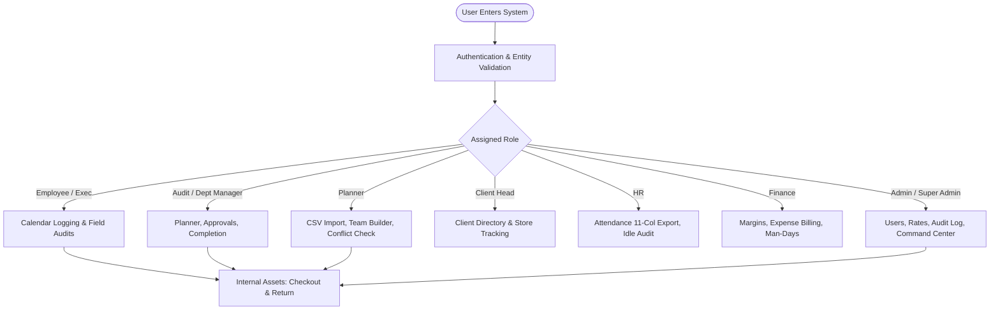

# KGAC Team Allocation & Operations Platform
# Master User Walkthrough Guide & Operating Manual

> [!NOTE]
> This master manual serves as the definitive reference document for all operations across **KGAC** and **KPL**. It documents all 11 user roles, system navigation, daily workflows, equipment lifecycle management, financial reconciliations, and universal data exports.

---

## Table of Contents
1. [Platform Architecture & Multi-Entity Framework](#1-platform-architecture--multi-entity-framework)
2. [Master Roles & Permissions Matrix](#2-master-roles--permissions-matrix)
3. [Universal Onboarding: Login, Registration & Profile](#3-universal-onboarding-login-registration--profile)
4. [Internal Asset Lifecycle & Hardware Custody Protocol](#4-internal-asset-lifecycle--hardware-custody-protocol)
5. [Role-by-Role Operating Guides](#5-role-by-role-operating-guides)
   - [5.1 Employee / Field Auditor](#51-employee--field-auditor)
   - [5.2 Audit Executive (Field Team Lead)](#52-audit-executive-field-team-lead)
   - [5.3 Audit Manager](#53-audit-manager)
   - [5.4 Operations / Department Manager](#54-operations--department-manager)
   - [5.5 Audit Planner & Scheduler](#55-audit-planner--scheduler)
   - [5.6 Backend Staff & Data Verification](#56-backend-staff--data-verification)
   - [5.7 Client Head & Account Lead](#57-client-head--account-lead)
   - [5.8 Human Resources (HR)](#58-human-resources-hr)
   - [5.9 Finance Specialist (Margins & Billing)](#59-finance-specialist-margins--billing)
   - [5.10 System Administrator](#510-system-administrator)
   - [5.11 Super Administrator (Platform Owner)](#511-super-administrator-platform-owner)
6. [Universal Data Export Guide (CSV & Excel)](#6-universal-data-export-guide-csv--excel)
7. [Troubleshooting & Frequently Asked Questions](#7-troubleshooting--frequently-asked-questions)

---

## 1. Platform Architecture & Multi-Entity Framework

The KGAC Platform is an enterprise resource planning and workforce management system engineered for high-volume retail audit operations, inventory verification, and team scheduling.



### Supported Entities
- **KGAC (K.G. Audit & Consulting):** Primarily handles domestic corporate statutory audits, inventory counts, and consulting engagements.
- **KPL (K.G. Professional Logistics / Services):** Manages enterprise retail store audits, third-party logistics counts, and contracted workforce operations.

Upon first login, team members confirm their assigned entity. All time allocations, billing rates, and client contracts track back to the correct balance sheet.

---

## 2. Master Roles & Permissions Matrix

The platform defines 11 specific roles. Each role is tailored to exact operational responsibilities:

| Module / Feature | Employee | Audit Exec | Audit Mgr | Dept Mgr | Planner | Backend | Client Head | HR | Finance | Admin | Super Admin |
| :--- | :---: | :---: | :---: | :---: | :---: | :---: | :---: | :---: | :---: | :---: | :---: |
| **Personal Timesheet Grid** | ✅ | ✅ | ✅ | ✅ | ✅ | ✅ | ✅ | ✅ | ✅ | ✅ | ✅ |
| **Department Calendar Oversight**| ❌ | View | ✅ | ✅ | View | ❌ | View | View | View | ✅ | ✅ |
| **Upcoming Audits Dashboard**| Own | Lead | All | Dept | All | ❌ | Client | All | All | All | All |
| **Asset Borrow & Return** | ✅ | ✅ | ✅ | ✅ | ✅ | ✅ | ✅ | ✅ | ✅ | ✅ | ✅ |
| **Asset Return Confirmation** | ❌ | ❌ | ✅ | ✅ | ❌ | ❌ | ❌ | ❌ | ❌ | ✅ | ✅ |
| **Leave Application** | ✅ | ✅ | ✅ | ✅ | ✅ | ✅ | ✅ | ✅ | ✅ | ✅ | ✅ |
| **Leave Approvals** | ❌ | ❌ | ✅ | ✅ | ❌ | ❌ | ❌ | View | ❌ | ✅ | ✅ |
| **Audit Planner & Team Builder**| ❌ | ❌ | ✅ | ✅ | ✅ | ❌ | View | ❌ | ❌ | ✅ | ✅ |
| **Client CSV Import** | ❌ | ❌ | ❌ | ❌ | ✅ | ❌ | ❌ | ❌ | ❌ | ✅ | ✅ |
| **Timesheet Completion Tracker**| ❌ | ❌ | ✅ | ✅ | ❌ | ❌ | ❌ | View | ❌ | ✅ | ✅ |
| **Attendance 11-Col Export** | ❌ | ❌ | Dept | Dept | ❌ | ❌ | ❌ | ✅ | ✅ | ✅ | ✅ |
| **Audit Margins & Billing** | ❌ | ❌ | ✅ | ❌ | ❌ | ❌ | ❌ | ❌ | ✅ | ✅ | ✅ |
| **Vendor Contractor Rates** | ❌ | ❌ | ❌ | ❌ | View | ❌ | ❌ | ❌ | View | ✅ | ✅ |
| **User & Role Provisioning** | ❌ | ❌ | ❌ | ❌ | ❌ | ❌ | ❌ | View | ❌ | ✅ | ✅ |
| **Audit Trail Inspection** | ❌ | ❌ | ❌ | ❌ | ❌ | ❌ | ❌ | ❌ | ❌ | ❌ | ✅ |
| **Command Center Telemetry** | ❌ | ❌ | ❌ | ❌ | ❌ | ❌ | ❌ | ❌ | ❌ | ❌ | ✅ |

---

## 3. Universal Onboarding: Login, Registration & Profile

### 3.1 Logging In
1. Open the platform URL in Google Chrome or Microsoft Edge.
2. Enter your assigned **Username** (e.g., `rahul.sharma`) and **Password**.
   > [!NOTE]
   > Do not enter `@kgac-users.com`. Just type your assigned username.
3. Click **Sign In**.


### 3.2 Entity Confirmation
New or unaligned users will be prompted with the **Entity Selector Modal**:
- Select **KGAC** or **KPL**.
- Click **Confirm Selection**.


### 3.3 Profile Management & Password Security
- Navigate to **My Profile** in the bottom-left sidebar.
- Inspect registered email, assigned entity badge, and functional roles.
- Update passwords using the secure password reset form.


---

## 4. Internal Asset Lifecycle & Hardware Custody Protocol

Field hardware custody follows a strict 4-step governance workflow:

```mermaid
sequenceDiagram
    autonumber
    actor Auditor as Employee / Auditor
    actor Manager as Department / Audit Mgr
    participant System as Asset System

    Auditor->>System: 1. Submit Equipment Request (Dates & Purpose)
    Manager->>System: 2. Approve Request & Physical Handover
    Note over Auditor,System: Equipment in use during field audit
    Auditor->>System: 3. Return Hardware & Click "Mark as Returned"
    System-->>Auditor: Dashboard displays "Awaiting Manager Confirmation"
    Manager->>System: 4. Physical Inspection & Click "Confirm Return"
    System-->>Auditor: Liability cleared; Asset status returned to "Available"
```

### Dashboard Asset Banners
1. **Overdue Return Warning Banner (Amber/Red):** Appears when the expected return date has passed and the asset has not been marked as returned.
2. **Awaiting Return Confirmation Banner (Blue):** Appears once the employee marks the asset returned, remaining active until the manager verifies the item.


---

## 5. Role-by-Role Operating Guides

### 5.1 Employee / Field Auditor
- **Role Code:** `employee`
- **Primary Modules:** `/calendar`, `/dashboard`, `/assets`, `/profile`.
- **Core Workflow:**
  1. Open Dashboard daily to check assigned store locations under **Upcoming Audits**.
  2. Open Calendar and log 8 hours daily against the assigned client project code.
  3. Submit leave requests (`pto` or `sick`) prior to absences.
  4. Borrow required field scanners in Internal Assets, and click **Mark as Returned** in *My Held Assets* immediately upon physical handover to the manager.


---

### 5.2 Audit Executive (Field Team Lead)
- **Role Code:** `audit_executive`
- **Primary Modules:** `/calendar`, `/dashboard`, `/assets`, `/profile`.
- **Core Workflow:**
  1. Review upcoming store teams on the dashboard 48 hours prior to audit launch.
  2. Lead on-site audit associates, ensuring all staff clock in on time.
  3. Report any discrepancy between scheduled store hours and actual count duration in calendar notes.
  4. Ensure on-site hardware is kept secure and return requests are submitted promptly post-audit.


---

### 5.3 Audit Manager
- **Role Code:** `audit_manager`
- **Primary Modules:** `/calendar`, `/planner`, `/dashboard`, `/assets`, `/reconciliation`, `/completion`, `/billing`.
- **Core Workflow:**
  1. Coordinate with planners to ensure store staffing targets are met.
  2. Review and approve pending leave requests in **Leave Approvals**.
  3. Inspect physical condition of returned hardware and click **Confirm Return** in Internal Assets.
  4. Monitor weekly timesheet submission in **Completion** to eliminate missing entries.
  5. Analyze audit profitability (revenue vs labor/travel costs) in **Audit Margins**.


---

### 5.4 Operations / Department Manager
- **Role Code:** `manager`
- **Primary Modules:** `/calendar`, `/planner`, `/dashboard`, `/assets`, `/completion`, `/admin/projects`.
- **Core Workflow:**
  1. Supervise weekly department allocations, using **Copy Previous Week** and **Apply to Week** for fast planning.
  2. Resolve idle days highlighted in red on the interactive calendar.
  3. Authorize gear requisitions and confirm returns for all department personnel.
  4. Configure department project codes and assign team members in Project Admin.


---

### 5.5 Audit Planner & Scheduler
- **Role Code:** `planner`
- **Primary Modules:** `/planner`, `/calendar`, `/dashboard`, `/assets`.
- **Core Workflow:**
  1. Ingest multi-store client schedules via **CSV Import**.
  2. Build audit teams using the **Team Builder Modal**, assigning Audit Executives and Field Auditors.
  3. Obey system conflict detection (flags double-booked auditors or auditors on approved leave in red).
  4. Allocate external vendor contractors when internal capacity is exhausted.
  5. Publish finalized rosters to push schedules to field calendars and dashboards.


---

### 5.6 Backend Staff & Data Verification
- **Role Code:** `backend_staff`
- **Primary Modules:** `/calendar`, `/dashboard`, `/assets`, `/profile`.
- **Core Workflow:**
  1. Perform backoffice store count verification, discrepancy indexing, and document audit.
  2. Log 8 hours daily on the Calendar under dedicated backend or client support project codes.
  3. Check out test hardware when configuring scanners or testing barcodes.


---

### 5.7 Client Head & Account Lead
- **Role Code:** `client_head`
- **Primary Modules:** `/admin/clients`, `/planner`, `/calendar`, `/dashboard`.
- **Core Workflow:**
  1. Maintain client master accounts, store network directories, and contract parameters in Client Admin.
  2. Monitor execution progress of client store audits across regions in the Audit Planner.
  3. Export client-specific progress summaries for stakeholder governance meetings.


---

### 5.8 Human Resources (HR)
- **Role Code:** `hr`
- **Primary Modules:** `/man-days`, `/dashboard`, `/admin/users`, `/admin/departments`, `/assets`, `/calendar`.
- **Core Workflow:**
  1. Audit company-wide idle days weekly on the Dashboard to ensure full labor utilization.
  2. Oversee employee master records and department assignments in User Admin.
  3. Export official monthly attendance files in **CSV** and **Excel** with the full 11 payroll columns.
  4. Audit central asset registries to ensure departing employees hold 0 unreturned assets.


---

### 5.9 Finance Specialist (Margins & Billing)
- **Role Code:** `finance`
- **Primary Modules:** `/reconciliation`, `/billing`, `/man-days`, `/calendar`, `/dashboard`.
- **Core Workflow:**
  1. Reconcile audit margins in **Reconciliation**, verifying that audit fee revenue exceeds total direct labor and contractor costs.
  2. Review and approve field expense claims in **Expense Billing** and designate items as client-reimbursable.
  3. Cross-reference incoming vendor agency invoices with billable contractor days in **Man-Days**.
  4. Export financial summaries in CSV and Excel for accounting journal entries.


---

### 5.10 System Administrator
- **Role Code:** `admin`
- **Primary Modules:** `/admin/users`, `/admin/departments`, `/admin/projects`, `/admin/vendors`, `/admin/clients`, `/admin/settings`, `/assets`.
- **Core Workflow:**
  1. Review new user registrations in **Pending Approvals**, assigning roles, departments, entities, and zones.
  2. Maintain department hierarchies and configure Department Managers.
  3. Configure external vendor agencies and negotiate daily contractor rate cards.
  4. Perform bulk equipment uploads using the Asset CSV Import Tool, and execute emergency asset reclaims.
  5. Configure company public holidays and core system settings.


---

### 5.11 Super Administrator (Platform Owner)
- **Role Code:** `super_admin`
- **Primary Modules:** `/admin/command-center`, `/admin/audit-log`, `/admin/database`, `/admin/roles`, plus unrestricted access to all platform routes.
- **Core Workflow:**
  1. Monitor platform health, database latency, and concurrent user sessions in the **Command Center**.
  2. Perform security forensic reviews of all system events and data changes in the **Audit Log Viewer**.
  3. Execute database maintenance routines (cache flush, table optimization, historical data archiving) in **Database Maintenance**.
  4. Authorize high-privilege administrative elevations in **Role Alignment**.


---

## 6. Universal Data Export Guide (CSV & Excel)

All tabular data across the KGAC platform supports one-click export in both **CSV** and **Excel (.xlsx)** formats.

### Export Catalog & Column Schemas

| Module | Export Trigger | Formats | Included Columns |
| :--- | :--- | :---: | :--- |
| **Attendance / Payroll** | Man-Days / Dashboard | CSV, Excel | `Employee ID`, `Name`, `Email`, `Department`, `Entity`, `Total Days`, `Working Days`, `Allocated Days`, `Idle Days`, `PTO Days`, `Sick Days` (11 Columns) |
| **Asset History** | Internal Assets -> Reports | CSV, Excel | `Asset ID`, `Code`, `Name`, `Category`, `Entity`, `Borrower Name`, `Borrow Date`, `Expected Return`, `Actual Return`, `Confirmed By`, `Status`, `Overdue Days` |
| **Timesheet Completion**| Completion Page | CSV, Excel | `Employee Name`, `Department`, `Week Of`, `Total Hours Logged`, `Billable Hours`, `Internal Hours`, `Submission Status`, `Mismatch Flag` |
| **Audit Margins** | Reconciliation Page | CSV, Excel | `Audit ID`, `Client Name`, `Store Code`, `Entity`, `Contract Revenue`, `Labor Cost`, `Contractor Cost`, `Expenses`, `Gross Margin (₹)`, `Margin %` |
| **System Audit Log** | Super Admin Audit Log | CSV, Excel | `Timestamp`, `Actor Username`, `Action Type`, `Target Entity`, `Target Record ID`, `Changes (Previous vs New JSON Diff)` |

---

## 7. Troubleshooting & Frequently Asked Questions

### Q1: Why does my Calendar cell show a red "IDLE" label?
**A:** A weekday has been left with 0 logged hours. Click on the cell, select your project code, enter 8 hours, and click Save.

### Q2: Why does my Dashboard have an amber banner saying "Equipment Overdue"?
**A:** The scheduled return date for company hardware in your custody has passed. Hand the item back to your manager and click **"Mark as Returned"** in the *My Held Assets* tab.

### Q3: Why does my Dashboard have a blue banner saying "Awaiting Return Confirmation"?
**A:** You clicked "Mark as Returned". The blue banner remains until your Department Manager physically inspects the device and clicks **Confirm Return** in the system.

### Q4: Why am I getting a "Double-Booked" conflict when scheduling an auditor?
**A:** The auditor is already allocated to another store audit during the same date range. You must pick an alternate auditor or adjust the audit dates.

### Q5: Can an auditor belong to both KGAC and KPL?
**A:** Every employee has a primary legal entity for timesheet and payroll purposes. However, Administrators can allocate personnel across projects owned by either entity when cross-charging is authorized.
