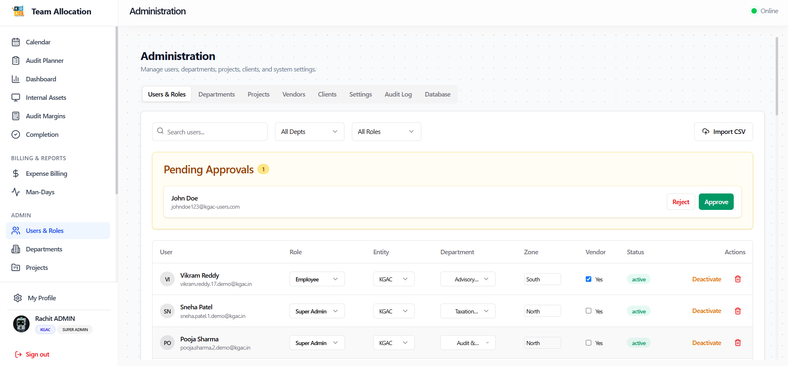
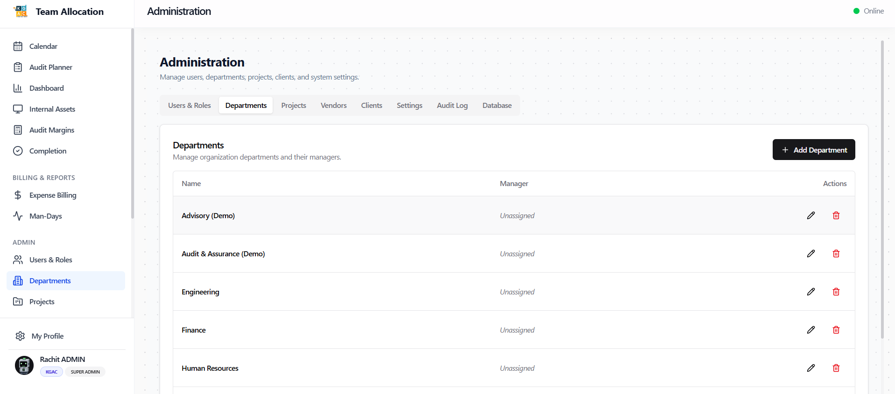
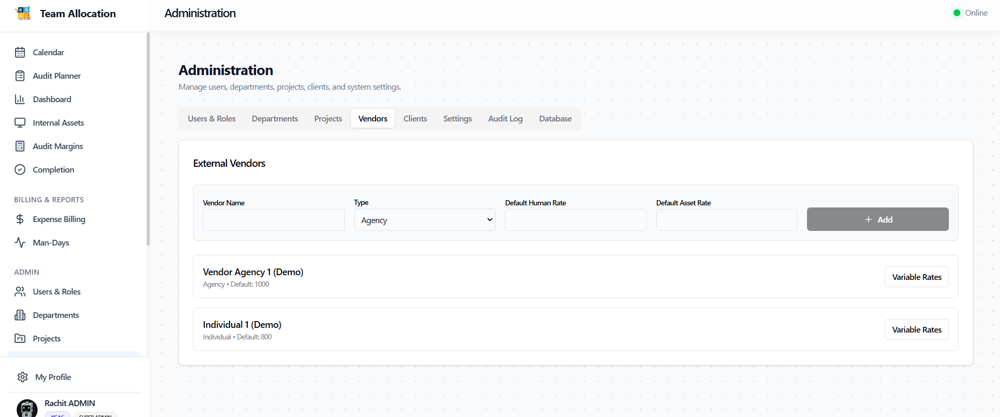
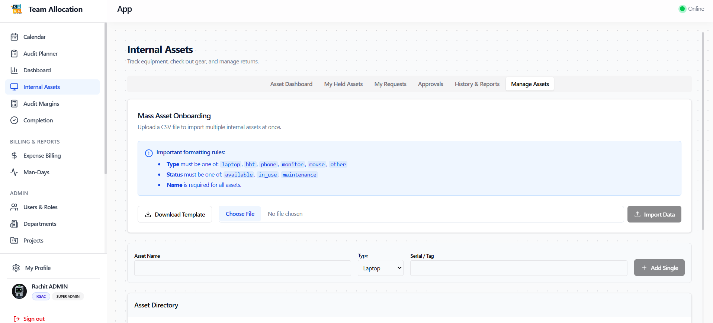

# Role Walkthrough Guide: System Administrator
## System Administration & Platform Management Manual

> [!NOTE]
> **Role Designation:** `admin` (System Administrator)  
> **Primary Purpose:** User onboarding and role assignment, entity alignment, department governance, vendor day-rates, client directories, system settings, and asset inventory administration.  
> **Supported Entities:** Kumar Aggarwal Gaurav and Co. & KGAC Pvt Ltd.

---

## 1. Role Scope & Key Responsibilities

As a **System Administrator**, you maintain the structural foundation of the Kumar Aggarwal Gaurav and Co. platform. You manage user access rights, organizational departments, client contracts, vendor commercial terms, and inventory registries across both business entities.

### Summary of Responsibilities
1. **User Provisioning & Role Elevation:** Approve new sign-ups, assign functional roles, link users to departments, and assign company entities (**Kumar Aggarwal Gaurav and Co.** or **KGAC Pvt Ltd.**).
2. **Department Structure & Leadership:** Maintain department listings and designate Department Managers.
3. **Vendor Agency & Contractor Pricing:** Manage external vendor profiles and configure day-rates for external audit contractors.
4. **Client Network Administration:** Maintain client accounts, store directories, and audit scopes.
5. **Asset Registry & Bulk Operations:** Ingest equipment via CSV bulk import, perform manual asset reclaims, and track inventory health.
6. **System Configuration:** Configure public holidays, operational working hours, and system-wide default settings.

---

## 2. System Access & Navigation Overview

| Navigation Item | Route | Key Purpose |
| :--- | :--- | :--- |
| **Users & Roles** | `/admin/users` | Approve pending accounts, assign roles, departments, and entities. |
| **Departments** | `/admin/departments`| Configure departments and assign manager oversight. |
| **Projects** | `/admin/projects` | Master project catalog, billable toggles, and team restrictions. |
| **Vendors** | `/admin/vendors` | External agency directory and contractor daily rate card. |
| **Clients** | `/admin/clients` | Enterprise client directory and store networks. |
| **Settings** | `/admin/settings` | Company working parameters, holidays, and system defaults. |
| **Calendar & Planner** | `/calendar`, `/planner`| Full administrative visibility and editing permissions. |
| **Internal Assets** | `/assets` | Asset catalog, bulk CSV import tool, and manual reclaims. |

---

## 3. Step-by-Step Operating Procedures

### 3.1 Reviewing & Approving Pending User Accounts
When a new employee registers on the login page or signs in via Google for the first time, their account enters `Pending Approval` status, displaying the pending screen to the user.

1. Navigate to **Users & Roles** (`/admin/users`).
2. Switch to the **Pending Approvals** tab.
3. For each pending user:
   - Verify the user's Full Name, Username, and Email.
   - Select their **Role** (e.g., `employee`, `audit_executive`, `manager`, `planner`, `hr`, `finance`).
   - Select their **Department** (e.g., *Audit*, *Operations*, *Finance*).
   - Assign their primary legal entity: **Kumar Aggarwal Gaurav and Co.** or **KGAC Pvt Ltd.**.
   - Assign their operational **Zone** (North, South, East, West).
4. Click **Approve User**.
5. The user is immediately granted active login access to the platform with permissions matching their assigned role.

---

### 3.2 Managing Departments & Manager Assignments
1. Navigate to **Departments** (`/admin/departments`).
2. To create a new department:
   - Click **Add Department**.
   - Enter name (e.g., *IT Services*, *Special Audits*).
   - Select the designated **Department Manager** from the dropdown list of active managers.
   - Click **Save**.
3. Department managers automatically receive approval authority for leave requests and asset returns submitted by employees in their department.

---

### 3.3 Configuring Vendor Agencies & Contractor Day-Rates
When external contractors are engaged for large-scale field audits:
1. Navigate to **Vendors** (`/admin/vendors`).
2. Click **Add Vendor Agency**.
3. Enter Agency Name, GSTIN, and Vendor Contact Info.
4. Under **Rate Card**, define the negotiated daily billing rate per contractor tier (e.g., *₹1,200 / day* for Assistant Auditor, *₹2,000 / day* for Senior Auditor).
5. These rates are automatically pulled into the Audit Planner and Audit Margins modules when contractors are scheduled.

---

### 3.4 Asset Catalog Bulk Import & Manual Reclaims
1. Navigate to **Internal Assets** (`/assets`).
2. Click **Bulk Import Assets (CSV)**.
3. Download the asset CSV template, containing columns:
   - `Asset Code`, `Asset Name`, `Category`, `Serial Number`, `Entity`, `Condition`.
4. Upload the completed CSV file to populate hundreds of barcode scanners or tablets in one operation.
5. **Manual Reclaim:**
   - If an employee has left the company or is unresponsive:
   - Locate the asset in the inventory table.
   - Click the administrator override action: **Force Reclaim Asset**.
   - Confirm the override to return the asset status to `Available`.

---

### 3.5 System Settings & Public Holiday Configuration
1. Navigate to **Settings** (`/admin/settings`).
2. Open the **Holidays** tab.
3. Click **Add Holiday** to input official company non-working dates (e.g., *Republic Day*, *Diwali*, *Independence Day*).
4. Configured holidays automatically shade the interactive calendar and prevent idle day flags on those dates.

---

## 4. Administrator Governance Checklist

- [ ] **Daily Sign-up Clearance:** Review and process pending account registrations twice daily (morning & afternoon).
- [ ] **Role Principle of Least Privilege:** Assign only the specific roles necessary for an employee's job duties.
- [ ] **Quarterly Rate Review:** Update vendor contractor day-rates when vendor contracts renew.
- [ ] **Inventory Reconciliation:** Audit the internal asset registry every month to account for all hardware assets.
