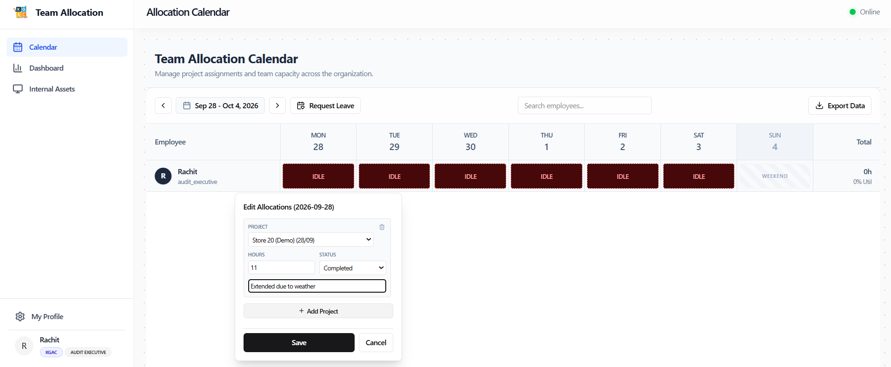

# Role Walkthrough Guide: Audit Executive
## Field Team Lead Operating Manual

> [!NOTE]
> **Role Designation:** `audit_executive` (Senior Field Auditor / On-Site Team Lead)  
> **Primary Purpose:** Field leadership, on-site auditor coordination, audit accuracy verification, and operational sync with Audit Managers and Planners.  
> **Supported Entities:** Kumar Aggarwal Gaurav and Co. & KGAC Pvt Ltd.

---

## 1. Role Scope & Key Responsibilities

As an **Audit Executive**, you are the primary on-site lead for Kumar Aggarwal Gaurav and Co./KGAC Pvt Ltd. field engagements. You lead audit associates and assistants during store inventory counts, asset verifications, and compliance inspections.

### Summary of Responsibilities
1. **On-Site Team Leadership:** Coordinate field teams at client locations, ensuring all auditors are present, equipped, and working according to client standards.
2. **Daily Hours & Activity Validation:** Ensure both you and your field associates log exact store hours, identifying and resolving any schedule mismatches.
3. **Audit Schedule Alignment:** Interface with the Audit Planner to confirm store arrival dates, crew size, and scope completion.
4. **Equipment Custody on Site:** Ensure all barcode scanners, tablets, and audit peripherals assigned to your team are accounted for throughout the audit.
5. **Incident & Variance Escalation:** Report on-site roadblocks, store inventory variances, or access issues directly to the Audit Manager.

---

## 2. System Access & Navigation Overview

| Navigation Item | Route | Key Purpose |
| :--- | :--- | :--- |
| **Calendar** | `/calendar` | Log personal hours, review team member hours across your department. |
| **Dashboard** | `/dashboard` | View upcoming field audits, location addresses, team composition, and asset alerts. |
| **Internal Assets** | `/assets` | Request high-capacity audit hardware and monitor team gear status. |
| **My Profile** | `/profile` | Manage contact details, zone assignment, and account security. |

---

## 3. Step-by-Step Operating Procedures

### 3.1 Authentication, Registration & Onboarding
Field team leads can authenticate using multiple convenient methods:
- **Sign In with Google:** Click **"Sign in with Google"** on the landing page and authenticate with your company email.
- **Username & Password:** Click **"Username & Password"**, enter your base username (without domain) and password, and click **Sign In**.
- **Create Account (New Leads):** Click **"Don't have an account? Sign up"**, fill in Full Name, Username, and Password, then click **"Create Account"**.
- **Account Pending Approval:** If newly registered, your account enters pending status until an Administrator assigns your role, entity (**Kumar Aggarwal Gaurav and Co.** or **KGAC Pvt Ltd.**), and department.
- **Entity Confirmation:** Confirm **Kumar Aggarwal Gaurav and Co.** or **KGAC Pvt Ltd.** on the first prompt to ensure store records route to the correct balance sheet.

---

### 3.2 Reviewing Scheduled Engagements on Dashboard
1. Review the **Upcoming Audits** module on the Dashboard (`/dashboard`).
3. Note:
   - Client Name and Store Location ID.
   - Start Date and Expected Completion Date.
   - Assigned Team Members (Auditors & Assistants).
4. Verify that you have received physical custody or confirmation of all required audit hardware.

---

### 3.2 Field Execution & Timesheet Management
1. When conducting an audit on-site, track total hours spent by each team member.
2. Navigate to **Calendar** (`/calendar`).
3. Log your personal 8-hour shift against the client project code.
4. If your team had to work extra hours due to high store inventory counts, ensure the hours are logged accurately (e.g., 9.5h or 10h). The system will highlight the cell with an amber over-allocation indicator to indicate overtime for manager review.

---

---

### 3.3 Equipment Custody & Return Handover
1. As team lead, you may request bulk batches of scanners for your crew via **Internal Assets** (`/assets`).
2. When the engagement concludes:
   - Collect all gear from field assistants.
   - Inspect all items for physical damage or missing chargers.
   - Return the gear to the office manager.
   - Open **Internal Assets** -> **My Held Assets** and click **"Mark as Returned"**.
3. Verify that your dashboard displays the blue "Awaiting Return Confirmation from Manager" banner.

---

## 4. Compliance & Lead Audit Checklist

- [ ] **Pre-Audit Briefing:** Check the Dashboard 48 hours prior to audit launch to verify team roster and store address.
- [ ] **Gear Check:** Test all barcode scanners and tablets before departing the main office.
- [ ] **On-Site Verification:** Verify all team members have clocked in and logged their project codes daily.
- [ ] **Post-Audit Debrief:** Submit return requests in *My Held Assets* immediately upon returning from the field.
