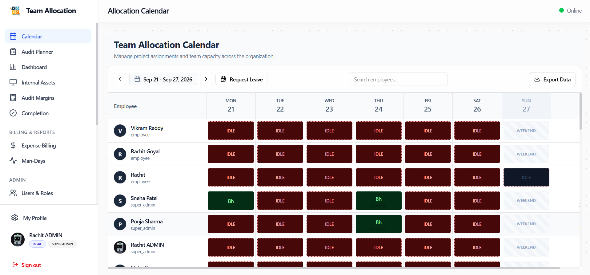
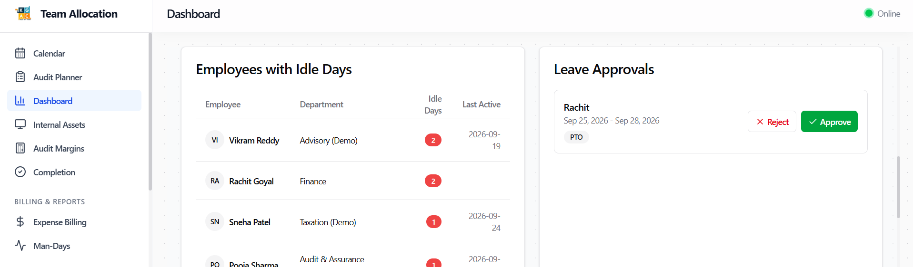
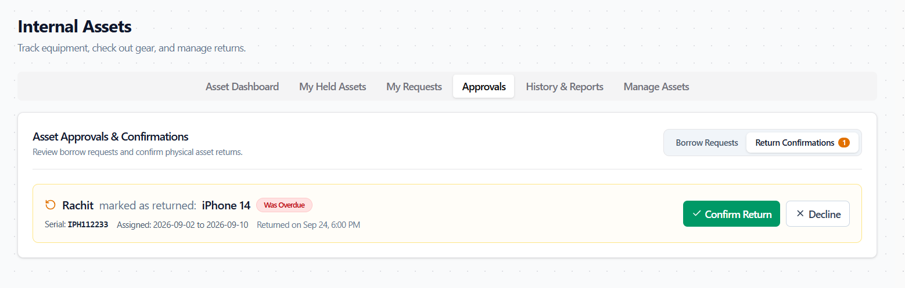
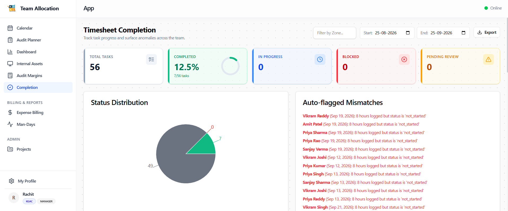
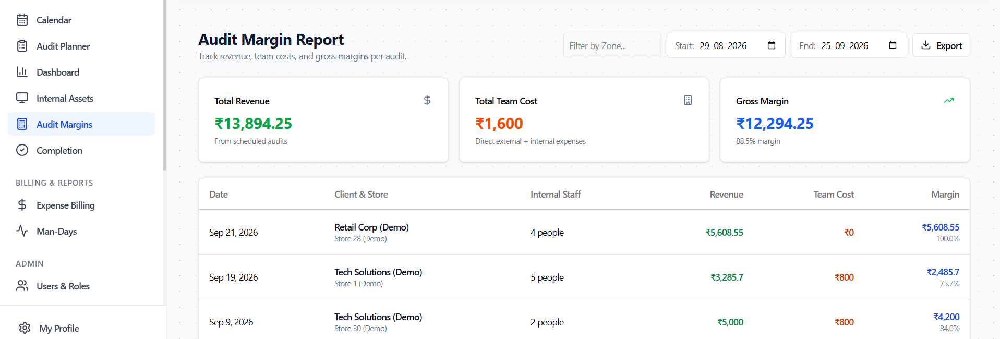

# Role Walkthrough Guide: Audit Manager
## Audit Engagement & Operations Manual

> [!NOTE]
> **Role Designation:** `audit_manager` (Audit Engagement Lead / Audit Project Manager)  
> **Primary Purpose:** Audit engagement delivery, team planning oversight, leave & equipment approvals, audit margins analysis, and timesheet completion verification.  
> **Supported Entities:** KGAC & KPL

---

## 1. Role Scope & Key Responsibilities

As an **Audit Manager**, you hold operational responsibility for planning, executing, and finalizing audit engagements. You bridge client audit requirements with field team execution, operational cost tracking, and compliance.

### Summary of Responsibilities
1. **Audit Engagement Management:** Coordinate with Planners and Client Heads to ensure all scheduled client stores are properly staffed with qualified auditors.
2. **Leave Approvals:** Review and approve/reject leave requests for auditors under your department.
3. **Internal Asset Verification:** Approve equipment borrow requests and physically inspect & confirm asset returns.
4. **Timesheet Completion Monitoring:** Track team hours, review zero-hour idle days, and reconcile planned vs logged store hours.
5. **Audit Margins & Financial Health:** Review profit margins (revenue vs employee/contractor costs) in Audit Margins.
6. **Data Exports:** Export department attendance, asset custody reports, and timesheet summaries in CSV and Excel.

---

## 2. System Access & Navigation Overview

| Navigation Item | Route | Key Purpose |
| :--- | :--- | :--- |
| **Calendar** | `/calendar` | Department-wide view of all auditor allocations; bulk copy tools. |
| **Audit Planner** | `/planner` | Build audit teams, review store requirements, track staffing status. |
| **Dashboard** | `/dashboard` | Department utilization charts, idle days table, and overdue asset alerts. |
| **Internal Assets** | `/assets` | Approve gear checkout, verify & confirm gear returns, export history reports. |
| **Audit Margins** | `/reconciliation` | Financial margin analysis per audit (contract value vs labor costs). |
| **Completion** | `/completion` | Timesheet submission tracking (Missing, Submitted, Mismatch). |
| **Expense Billing** | `/billing` | Review reimbursable audit expenses and contractor day-rates. |
| **Man-Days** | `/man-days` | Billable vs internal man-days summary across department staff. |
| **Projects** | `/admin/projects` | Manage project codes, billable flags, and project team members. |

---

## 3. Step-by-Step Operating Procedures

### 3.1 Managing the Department Calendar & Allocations
1. Open **Calendar** (`/calendar`).
2. Use the Department dropdown to filter to your department (e.g., *Audit*).
3. Review row-by-row staffing across the current week.
4. **Bulk Planning Tools (Manager Only):**
   - Click **Copy Previous Week** to roll forward ongoing recurring allocations.
   - Click **Apply to Week** to quickly replicate a single day's allocation across all 5 weekdays for an auditor.
5. Identify any red **IDLE** cells and assign the auditor to internal training or scheduled store audits.

---

### 3.2 Reviewing & Approving Leave Requests
When field associates submit PTO or Sick leave requests:
1. Navigate to **Leave Approvals** (accessible via Dashboard alert or Admin dropdown).
2. Review the applicant's name, requested date range, leave type, and reason.
3. Check the Calendar to ensure approving the leave does not leave an active store audit understaffed.
4. Click **Approve** (green checkmark) or **Reject** with a comment.
5. Approved leaves automatically reflect on the calendar with locked gray/orange indicators.

---

### 3.3 Verifying & Confirming Asset Returns
Field gear integrity is critical to avoiding lost hardware.

#### Step 1: Approving Asset Checkout
1. Open **Internal Assets** (`/assets`).
2. Under **Pending Approvals**, review requested items, dates, and requesting auditor.
3. Click **Approve Checkout** to authorize equipment release.

#### Step 2: Confirming Physical Return
1. When an auditor brings back hardware and clicks "Mark as Returned", the item moves to **Pending Confirmation**.
2. **Physical Inspection:** Verify serial number, test scanner power, and ensure cables/chargers are returned undamaged.
3. In **Internal Assets** -> **Pending Approvals**, locate the return request.
4. Click **Confirm Return**.
5. The equipment status immediately returns to `Available` for other teams to borrow, and the auditor's dashboard warning banner clears.

---

### 3.4 Tracking Timesheet Completion & Mismatches
1. Navigate to **Completion** (`/completion`).
2. Filter by week and department.
3. The table categorizes each team member into:
   - **Complete (Green):** 40+ hours properly logged.
   - **Missing (Red):** Unallocated days / incomplete hours.
   - **Mismatch (Amber):** Hours logged on projects different from the Audit Planner's scheduled stores.
4. Export the completion report in Excel or CSV to follow up with team leads.

---

### 3.5 Analyzing Audit Margins
1. Navigate to **Audit Margins** (`/reconciliation`).
2. Select the client engagement.
3. The platform computes:
   - Total Client Contract Revenue.
   - Total Internal Labor Cost (calculated from logged auditor hours).
   - External Contractor Cost (vendor day-rates).
   - Travel & Miscellaneous Expenses.
   - **Gross Profit Margin (%)**.
4. Use this data to identify unprofitable store audits or scope creep.

---

### 3.6 Exporting Department Asset History
1. Navigate to **Internal Assets** -> **Asset History & Reports** tab.
2. Filter by employee name or date range.
3. Click **Export as CSV** or **Export as Excel**.
4. The generated report contains full audit trails: checkout timestamp, return timestamp, approver ID, and overdue status.

---

## 4. Managerial Review Checklist

- [ ] **Weekly Allocation Audit:** Every Friday by 4 PM, verify 100% calendar completion for all department auditors.
- [ ] **Prompt Asset Release:** Confirm physical equipment returns within 2 hours of handover.
- [ ] **Margin Reconciliations:** Perform margin reconciliations within 5 days of audit completion.
- [ ] **Overtime Review:** Investigate any timesheet entries exceeding 10 hours daily.
