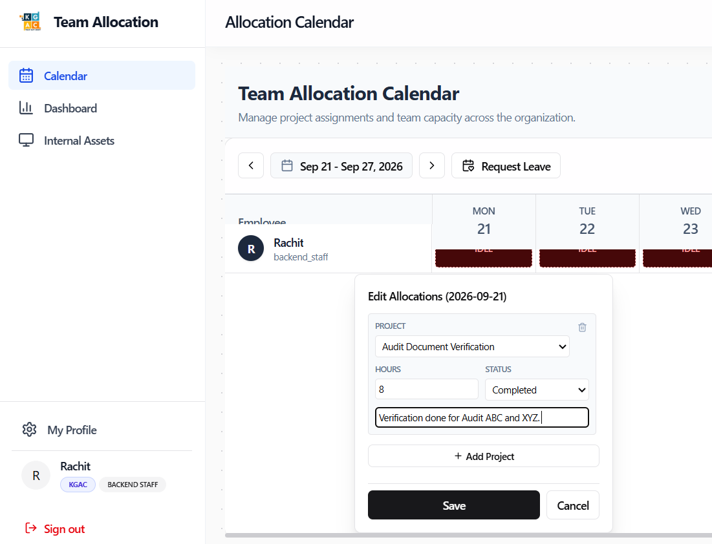

# Role Walkthrough Guide: Backend Staff
## Backoffice Operations & Support Manual

> [!NOTE]
> **Role Designation:** `backend_staff` (Backend Operations / Data Entry / Audit Support Staff)  
> **Primary Purpose:** Backoffice operations, audit data verification, inventory data processing, internal support, and daily timesheet reporting.  
> **Supported Entities:** KGAC & KPL

---

## 1. Role Scope & Key Responsibilities

As a member of the **Backend Staff**, you perform essential operational support that keeps audit engagements running smoothly. You handle data entry, audit document indexing, preliminary reconciliation, and internal project coordination.

### Summary of Responsibilities
1. **Daily Work Logging:** Record your daily support hours accurately on the Calendar (minimum 8 hours daily).
2. **Backoffice Project Allocation:** Categorize hours under relevant internal codes (e.g., *Data Verification*, *Report Formatting*, *Internal Ops*).
3. **Office Asset Management:** Manage any company equipment or IT peripherals in your possession.
4. **Leave Compliance:** Submit leave applications in advance through the platform.
5. **Operational Verification:** Assist managers and planners in cross-verifying store count sheets and documentation.

---

## 2. System Access & Navigation Overview

| Navigation Item | Route | Key Purpose |
| :--- | :--- | :--- |
| **Calendar** | `/calendar` | Weekly timesheet grid to log daily work hours against internal and client support codes. |
| **Dashboard** | `/dashboard` | View personal allocation summary, department notices, and asset return reminders. |
| **Internal Assets** | `/assets` | Request borrowable equipment and track currently held hardware. |
| **My Profile** | `/profile` | Manage contact information and update account passwords. |

---

## 3. Step-by-Step Operating Procedures

### 3.1 Authentication, Registration & Onboarding
Backend operations team members access the platform via:
- **Sign In with Google:** Click **"Sign in with Google"** with your authorized company email.
- **Username & Password:** Click **"Username & Password"**, enter username (without domain) and password.
- **Create Account (New Staff):** Register via **"Don't have an account? Sign up"**. Newly registered accounts display **Account Pending Approval** until assigned the `backend_staff` role by an Administrator.
- **Entity Confirmation:** Confirm **KGAC** or **KPL** on first login.

---

### 3.2 Logging Daily Support Hours on the Calendar
1. Log into the platform: `https://kgac-allocation.vercel.app`.
2. Navigate to **Calendar** (`/calendar`).
3. Locate your personal row for the active work week.
4. Click the cell for today's date.
5. In the popover:
   - **Project:** Select the appropriate project (e.g., `INTERNAL-OPS`, `DATA-REVIEW`, or the specific client code if doing dedicated data entry).
   - **Hours:** Enter `8.0` for a standard workday.
   - **Status:** Select `internal` for general office operations, or `billable` if working directly on dedicated client deliverables.
   - **Notes:** Add a short summary of completed work (e.g., "Verified 14 store count sheets for Reliance Retail").
6. Click **Save**.

---

### 3.2 Submitting Leave & Time Off
1. When requesting leave (planned vacation or sick days):
2. Click the calendar date cell.
3. Select `pto` or `sick`.
4. Enter brief notes explaining the absence.
5. Click **Save**. The request routes immediately to your Department Manager.

---

### 3.3 Equipment Custody & Handover
1. If you need a testing tablet, spare barcode scanner, or power bank:
2. Open **Internal Assets** (`/assets`).
3. Browse **Available Equipment** and click **Request / Borrow**.
4. Specify dates and purpose.
5. When finished, open **My Held Assets** and click **"Mark as Returned"** before handing the device back to the office manager.

---

## 4. Backend Operating Standards Checklist

- [ ] **Daily Submission:** Log hours before ending your shift at 6:00 PM.
- [ ] **Accurate Project Tagging:** Ensure client-specific data entry is tagged with client project codes, not generic internal codes.
- [ ] **Asset Return Discipline:** Never keep equipment past the due date without submitting an extension request.
