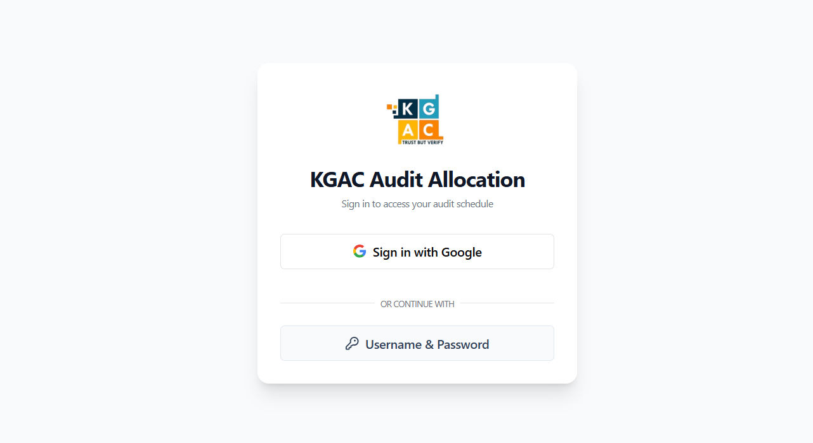
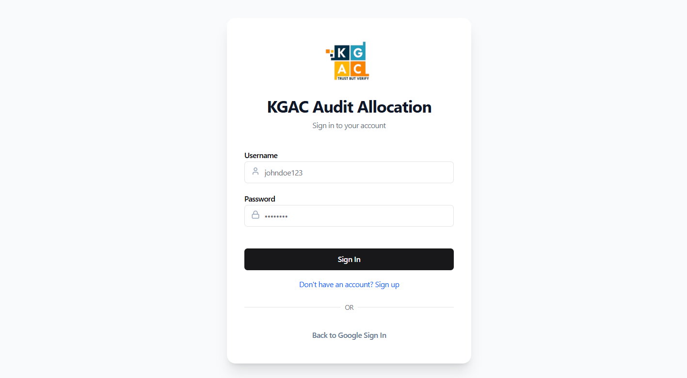
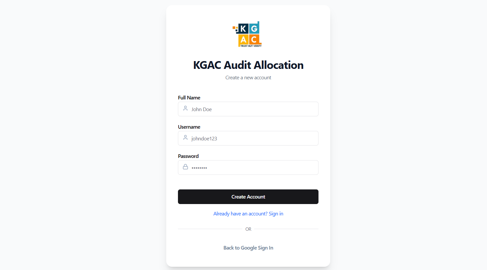
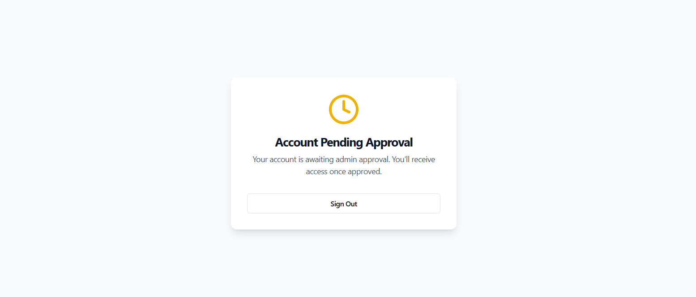
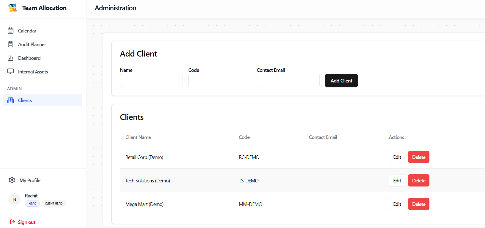
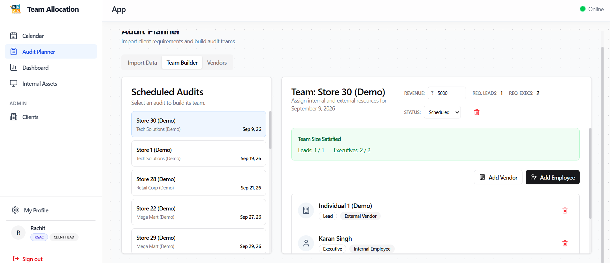

# Role Walkthrough Guide: Client Head
## Client Accounts & Engagement Leadership Manual

> [!NOTE]
> **Role Designation:** `client_head` (Client Lead / Account Director)  
> **Primary Purpose:** Client relationship management, client store master directory oversight, audit SLA compliance, and cross-account delivery tracking.  
> **Supported Entities:** KGAC & KPL

---

## 1. Role Scope & Key Responsibilities

As a **Client Head**, you own the strategic and operational relationship between KGAC/KPL and major enterprise clients (e.g., nationwide retail chains, telecom providers, consumer goods brands). You oversee client directory data, store coverage, and audit execution SLAs.

### Summary of Responsibilities
1. **Client Master Management:** Configure enterprise client accounts, key points of contact, and contract terms in Client Admin.
2. **Store Network Directory:** Oversee the master list of client retail outlets, warehouses, and distribution centers.
3. **Audit Schedule Alignment:** Work with Audit Planners to verify that client contract schedules are fully staffed and running on time.
4. **Delivery & SLA Tracking:** Review audit completion metrics across all assigned accounts to ensure 100% on-time audit delivery.
5. **Issue Escalation & Governance:** Address client store access bottlenecks or scheduling delays.

---

## 2. System Access & Navigation Overview

| Navigation Item | Route | Key Purpose |
| :--- | :--- | :--- |
| **Clients** | `/admin/clients` | Master directory of client accounts, contracts, contacts, and store locations. |
| **Audit Planner** | `/planner` | High-level schedule tracking, store coverage review, and delivery status. |
| **Calendar** | `/calendar` | Personal timesheet logging and team visibility. |
| **Dashboard** | `/dashboard` | Executive overview of upcoming client audits and platform activities. |
| **Internal Assets** | `/assets` | Standard equipment catalog and personal requisitions. |
| **My Profile** | `/profile` | User contact information and credential management. |

---

## 3. Step-by-Step Operating Procedures

### 3.1 Authentication, Registration & Onboarding
Client Heads access enterprise accounts via:
- **Sign In with Google:** Click **"Sign in with Google"** with your authorized company email.
- **Username & Password:** Click **"Username & Password"**, enter username (without domain) and password.
- **Create Account (New Client Leads):** Register via **"Don't have an account? Sign up"**. Newly registered accounts display **Account Pending Approval** until assigned the `client_head` role by an Administrator.
- **Entity Confirmation:** Confirm **KGAC** or **KPL** on first login.

---

### 3.2 Managing Client Accounts & Contracts
1. Navigate to **Clients** (`/admin/clients`).
2. To register a new enterprise client:
   - Click **Add Client**.
   - Enter **Client Name**, **Company Code**, and **Industry Sector**.
   - Input primary client contact details (Email, Phone, Designation).
   - Designate contractual entity (**KGAC** or **KPL**).
3. To update an existing client:
   - Click **Edit** on the client card.
   - Modify billing addresses, active store counts, or status (Active / Inactive).
   - Click **Save Changes**.

---

### 3.2 Supervising Client Store Schedules in Audit Planner
1. Navigate to **Audit Planner** (`/planner`).
2. Use the Client filter dropdown to isolate your specific client accounts.
3. Review the execution status of scheduled stores:
   - **Unassigned (Gray):** Stores requiring team allocation by the Planner.
   - **Scheduled (Blue):** Field team roster assembled and confirmed.
   - **In Progress (Amber):** Field team currently on-site conducting counts.
   - **Completed (Green):** Audit completed and reconciled.
4. Identify any unstaffed stores within 5 days of execution and coordinate with the Audit Planner to prioritize staffing.

---

### 3.3 Exporting Account Reports for Client Reviews
1. In the **Clients** portal or **Completion** tracker:
2. Filter the report to the target client account.
3. Export the schedule status report via **Export as Excel**.
4. Use this structured data for weekly client governance and executive stakeholder reviews.

---

## 4. Client Leadership Checklist

- [ ] **Store Directory Accuracy:** Ensure client store addresses, store manager contacts, and store codes are updated before schedule import.
- [ ] **Weekly SLA Review:** Review the Audit Planner every Monday to ensure 100% of upcoming stores for the month are accounted for.
- [ ] **Billing Entity Verification:** Verify that new client contracts are assigned to the correct billing entity (KGAC vs KPL).
