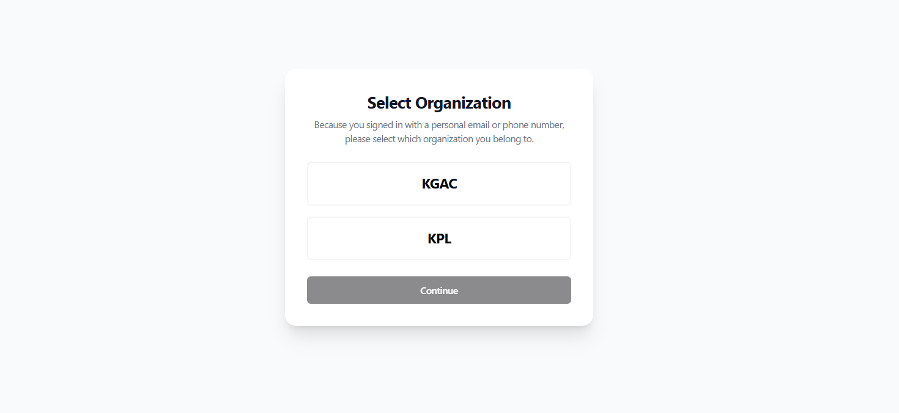
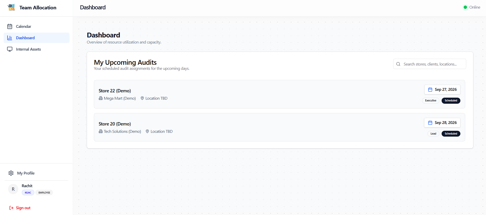
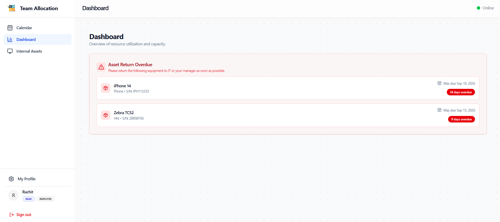
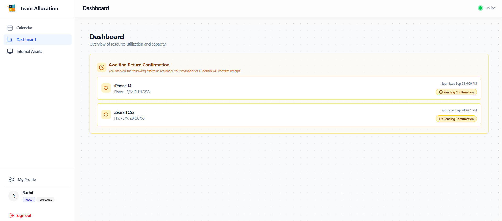
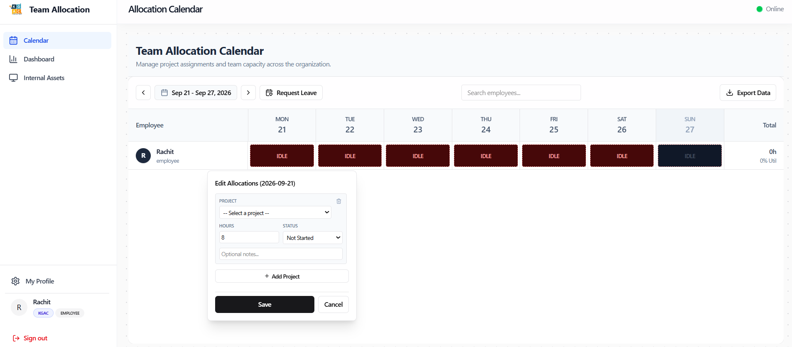
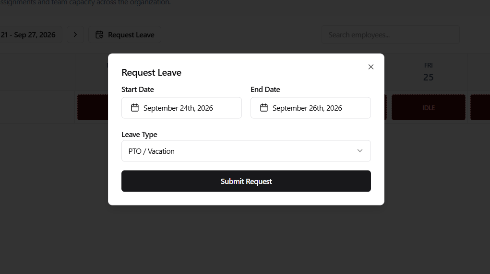
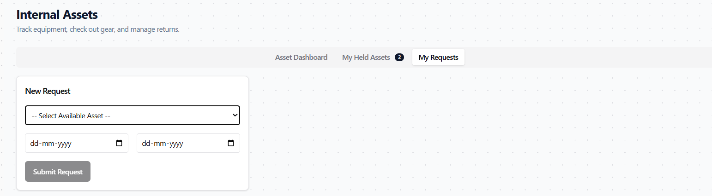
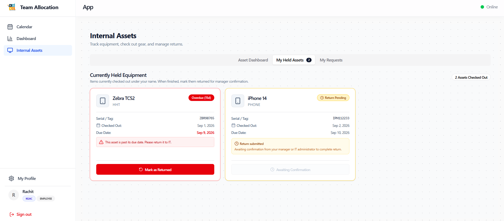
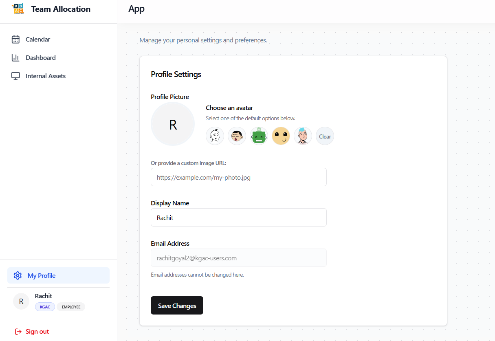

# Role Walkthrough Guide: Employee / Field Auditor
## Operating Manual & Standard Operating Procedures

> [!NOTE]
> **Role Designation:** `employee` (Field Auditor / Audit Associate / Assistant)  
> **Primary Purpose:** Field audit execution, accurate daily hours allocation, equipment requisition & return, and personal leave management.  
> **Supported Entities:** KGAC & KPL

---

## 1. Role Scope & Key Responsibilities

As an **Employee / Field Auditor**, your primary daily responsibility is ensuring timely, accurate reporting of your work hours on client audits, managing company-issued field equipment (scanners, tablets, laptops), and tracking your upcoming field audit assignments.

### Summary of Responsibilities
1. **Daily Allocation Logging:** Log your exact working hours (minimum 8h on working days) mapped to the correct client audit project code.
2. **Upcoming Audits Readiness:** Review your assigned audit dates and store locations on your dashboard.
3. **Internal Asset Lifecycle:** Request field equipment in advance, maintain proper custody, and immediately mark equipment as returned upon physical handback to your manager.
4. **Attendance & Leave Requests:** Submit PTO, sick leave, or comp-off requests through the platform prior to absence.
5. **Profile & Security:** Keep your contact details, assigned entity (KGAC/KPL), and credentials up to date.

---

## 2. System Access & Navigation Overview

Upon logging in, employees have access to the following core platform modules:

| Navigation Item | Route | Key Purpose |
| :--- | :--- | :--- |
| **Calendar** | `/calendar` | Weekly timesheet grid to log hours against projects. |
| **Dashboard** | `/dashboard` | View upcoming audit schedule and overdue asset return alerts. |
| **Internal Assets** | `/assets` | Request borrowable equipment and manage held equipment. |
| **My Profile** | `/profile` | Manage contact details, view assigned entity, and reset password. |

---

## 3. Step-by-Step Daily Workflows

### 3.1 Logging In, Registration & Account Approval

The platform provides flexible authentication methods depending on how your credentials were issued:

#### Option A: Sign In with Google (OAuth SSO)
1. On the landing page, click **"Sign in with Google"**.
2. Authenticate using your authorized company Google account (e.g., `rahul.sharma@kgac.in`).
3. If your account is newly registered, you will be redirected to the **Account Pending Approval** screen awaiting administrative approval.

#### Option B: Sign In with Username & Password
1. Click **"Username & Password"** on the landing page.
2. Enter your assigned **Username** (e.g., `rahul.sharma`).
   > [!NOTE]
   > Do not append `@kgac-users.com`. Just enter your base username.
3. Enter your **Password** and click **Sign In**.

#### Option C: Self-Registration (Create User / Sign Up)
If you are a new field auditor joining the organization:
1. On the Username & Password screen, click **"Don't have an account? Sign up"**.
2. Enter your **Full Name**, desired **Username**, and a secure **Password** (min. 6 characters).
3. Click **"Create Account"**.
4. The system switches back to the sign-in form. Log in with your new credentials.

#### Account Pending Approval State
Newly registered accounts are held in pending status until verified by an Administrator:
- The screen displays a yellow clock icon and the notice: *"Your account is awaiting admin approval. You'll receive access once approved."*
- An Administrator will review your account in `/admin/users`, assign your `employee` role, department, entity (**KGAC** or **KPL**), and zone.
- Once approved, simply refresh your browser or log in again to enter your dashboard.

#### Entity Selection (KGAC vs KPL)
Upon your first approved login, if prompted:
1. Select your contractual employment entity: **KGAC** or **KPL**.
2. Click **Confirm Selection**.

---

### 3.2 Checking Your Personal Dashboard
Your Dashboard is your daily flight deck. It provides:
1. **Upcoming Audits Card:** Displays client audits you have been scheduled for by the Planner, including store location, dates, and team lead.
2. **Asset Warning Banners:**
   - **Overdue Return Warning (Amber/Red):** Displays when the scheduled return date for borrowed equipment has passed.
   - **Awaiting Confirmation Banner (Blue):** Displays after you click "Mark as Returned", notifying you that the physical return is pending your manager's confirmation.

---

### 3.3 Logging Daily Hours on the Calendar
Field auditors must record hours worked daily to ensure compliance with client billable hours and internal payroll.

1. Navigate to **Calendar** (`/calendar`).
2. Your personal row is displayed for the current week (Monday through Sunday).
3. Click on the cell corresponding to the target date.
4. In the **Edit Allocation** popover:
   - **Project:** Select the client project code for the audit (e.g., `PROJECT-ALPHA`, `STORE-AUDIT-RETAIL`).
   - **Hours:** Enter hours worked (typically `8.0` for a standard workday).
   - **Status:** Select `billable` (client work) or `internal` (office/training).
   - **Notes (Optional):** Enter store ID, inventory section audited, or travel notes.
5. Click **Save** or press **Enter**.
6. The cell turns **Green** for billable work or **Purple** for internal work.

> [!WARNING]
> Unfilled working days display a bright red **IDLE** indicator. HR and your manager review idle days weekly for payroll validation. Always ensure all weekdays are allocated.

---

### 3.4 Submitting Leave & PTO Requests
If you need time off for sick leave, planned vacation, or personal reasons:
1. Open the **Calendar** and click the target date cell.
2. In the status dropdown, choose either **`pto`** (Planned Leave) or **`sick`** (Sick Leave).
3. The hours field automatically sets to 8.0 hours and locks the project field.
4. Add any relevant notes (e.g., "Doctor appointment" or "Family function").
5. Click **Save**.
6. The request automatically routes to your Department Manager for approval. Once approved, the cell turns **Gray** (`PTO`) or **Orange** (`SICK`).

---

### 3.5 Internal Equipment: Borrowing & Returning Field Gear
Field audits require equipment such as barcode scanners, handheld terminals, or laptops.

#### Step 1: Requesting Equipment
1. Navigate to **Internal Assets** (`/assets`).
2. In the **Available Equipment** catalog, browse by category (e.g., *Barcode Scanner*, *Tablet*).
3. Click **Request / Borrow**.
4. Select your **Borrow Date** and **Expected Return Date**.
5. State the intended audit/store purpose.
6. Click **Submit Request**. Your manager will be alerted to approve the dispatch.

#### Step 2: Managing Held Assets & Marking Return
1. Once the asset is handed to you and approved, it appears in your **My Held Assets** tab (`/assets`).
2. When your audit is finished and you physically return the gear to the office manager:
   - Go to **Internal Assets** -> **My Held Assets**.
   - Locate the equipment card.
   - Click the blue **"Mark as Returned"** button.
   - Confirm the prompt.
3. Your dashboard banner will immediately update to **"Awaiting Return Confirmation from Manager"**.
4. Once your manager verifies the physical condition and clicks confirm, the item is removed from your custody.

---

### 3.6 Profile & Password Management
1. Click **My Profile** in the bottom left sidebar navigation.
2. View your assigned username, registered email, and assigned entity badge (**KGAC** or **KPL**).
3. To update your password:
   - Enter your current password.
   - Enter your new secure password (minimum 8 characters).
   - Click **Update Password**.
4. To sign out at the end of your shift, click the red **Sign Out** button in the sidebar.

---

## 4. Auditor Best Practices & Compliance Checklist

- [ ] **End of Day Rule:** Log your calendar hours at the end of each audit shift or no later than 10:00 AM the following morning.
- [ ] **Zero Overdue Tolerance:** If an audit extends beyond your initial equipment return date, notify your manager to extend the reservation before it becomes overdue.
- [ ] **Store Mismatch:** If your on-site hours differ from the planner's scheduled allocation, add an explanatory note in the calendar cell.
- [ ] **Logout on Shared Terminals:** Always sign out when logging hours from shared client backroom computers.
