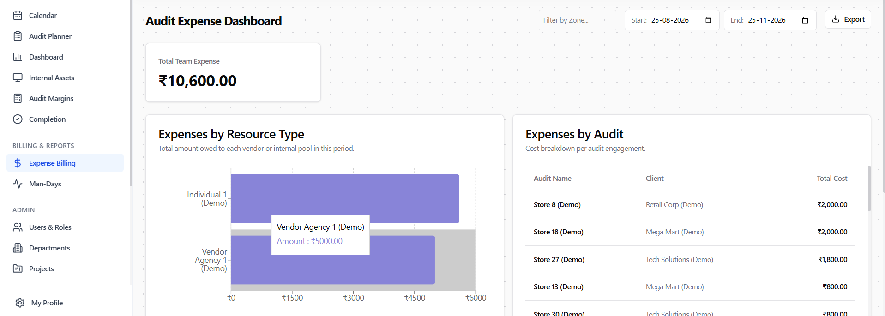
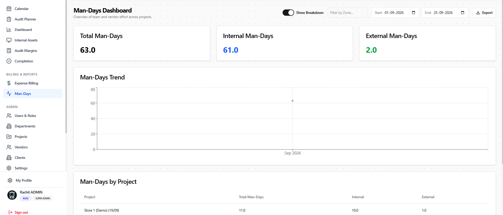

# Role Walkthrough Guide: Finance Specialist
## Financial Reconciliation & Billing Manual

> [!NOTE]
> **Role Designation:** `finance` (Finance Specialist / Billing & Margins Analyst)  
> **Primary Purpose:** Audit engagement profitability analysis, margin reconciliation, contractor cost verification, expense billing, and client invoicing readiness.  
> **Supported Entities:** KGAC & KPL

---

## 1. Role Scope & Key Responsibilities

As a **Finance Specialist**, you safeguard the commercial health and billing integrity of KGAC and KPL. You reconcile project revenues against labor expenses, contractor day-rates, and field incidentals to ensure healthy profit margins and prompt client billing.

### Summary of Responsibilities
1. **Audit Margins & Reconciliation:** Calculate exact profitability per audit by comparing client billing fees against auditor labor hours and contractor rates.
2. **Expense Billing Governance:** Review and approve reimbursable audit expenses (hotel, fuel, flight, daily per-diem allowances).
3. **Contractor Cost Auditing:** Validate vendor agency invoices against billable man-days recorded in the system.
4. **Entity Revenue Allocation:** Ensure billing records, client contracts, and vendor payments route cleanly to the correct company balance sheet (**KGAC** or **KPL**).
5. **Commercial Data Exports:** Export margin models and billing registers in CSV and Excel formats.

---

## 2. System Access & Navigation Overview

| Navigation Item | Route | Key Purpose |
| :--- | :--- | :--- |
| **Audit Margins** | `/reconciliation` | Client revenue vs direct labor and overhead cost reconciliation. |
| **Expense Billing** | `/billing` | Reimbursable audit expense management and invoice prep. |
| **Man-Days** | `/man-days` | Billable man-days breakdown: internal employees vs external contractors. |
| **Calendar** | `/calendar` | Read-only access to time allocations across projects. |
| **Dashboard** | `/dashboard` | High-level platform metrics and utilization data. |
| **Internal Assets** | `/assets` | Asset registry and depreciation / replacement cost review. |
| **My Profile** | `/profile` | User credentials and security settings. |

---

## 3. Step-by-Step Operating Procedures

### 3.1 Authentication, Registration & Onboarding
Finance team members access billing and margin models via:
- **Sign In with Google:** Click **"Sign in with Google"** with your authorized company email.
- **Username & Password:** Click **"Username & Password"**, enter username (without domain) and password.
- **Create Account (New Finance Staff):** Register via **"Don't have an account? Sign up"**. Newly registered accounts display **Account Pending Approval** until assigned the `finance` role by an Administrator.
- **Entity Confirmation:** Confirm **KGAC** or **KPL** on first login.

---

### 3.2 Conducting Audit Margins Reconciliation
1. Navigate to **Audit Margins** (`/reconciliation`).
2. Filter by Client Engagement and Audit Month.
3. Review the financial breakdown:
   - **Contract Value:** Total fees agreed with the client for the store audit.
   - **Internal Labor Cost:** Automatically calculated as: `(Hours Logged) × (Auditor Hourly Base Rate)`.
   - **Vendor Contractor Cost:** Calculated as: `(Contractor Days) × (Vendor Day-Rate)`.
   - **Reimbursable Expenses:** Travel, lodging, meals.
   - **Net Margin:** The resulting gross profit figure and percentage margin.
4. If an engagement shows a negative or sub-target margin (<25%):
   - Click into the engagement details to identify whether excess hours were logged, or whether expensive external contractors were over-utilized.

---

### 3.2 Processing Expense Billing & Reimbursables
1. Navigate to **Expense Billing** (`/billing`).
2. Review audit expense claims submitted by field teams.
3. Verify supporting receipts for:
   - Inter-city travel and local transit.
   - Accommodation and per-diem meals.
   - Miscellaneous supplies.
4. Flag items as **Billable to Client** or **Internal Company Expense**.
5. Click **Approve for Invoicing**.
6. Export the final billing schedule via **Export as Excel** to generate customer invoices.

---

### 3.3 Auditing Contractor Man-Days for Vendor Payments
1. Open **Man-Days** (`/man-days`).
2. Switch filter to **Contractor Staff**.
3. Group by **Vendor Agency Name**.
4. Cross-reference the logged days with incoming vendor invoices:
   - Verify that the vendor did not bill for 10 days if the contractor only worked 8 days on-site.
5. Export the verified contractor summary in CSV/Excel for accounts payable sign-off.

---

## 4. Finance Review Standards Checklist

- [ ] **Billing Timeliness:** Reconcile audit margins within 3 business days of audit completion.
- [ ] **Receipt Verification:** Never approve an expense over ₹500 without a valid tax invoice or digital receipt attached.
- [ ] **Contractor Rate Match:** Ensure contractor rates applied in the margin calculation match the signed Master Service Agreement (MSA).
- [ ] **Export Verification:** Ensure both CSV and Excel exports reflect all adjustments before transmission to accounting.
