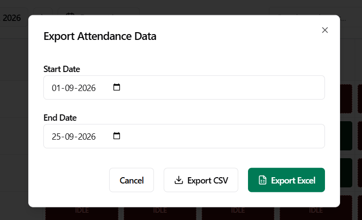
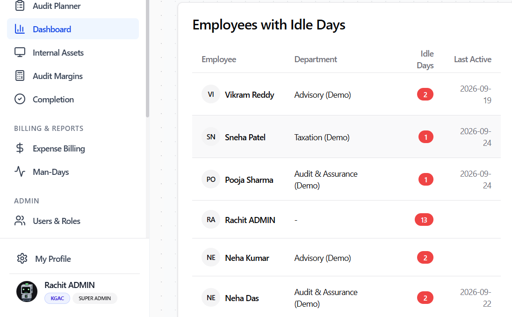

# Role Walkthrough Guide: Human Resources (HR)
## People Operations & Attendance Governance Manual

> [!NOTE]
> **Role Designation:** `hr` (Human Resources Specialist / People Operations Lead)  
> **Primary Purpose:** Organization-wide attendance governance, payroll reporting, leave management oversight, idle day monitoring, and hardware custody compliance.  
> **Supported Entities:** KGAC & KPL

---

## 1. Role Scope & Key Responsibilities

As a member of **Human Resources (HR)**, you are the custodian of workforce compliance, employee attendance accuracy, and leave governance. You verify that all employees across KGAC and KPL fulfill their working day requirements and generate official attendance records for monthly payroll.

### Summary of Responsibilities
1. **Attendance & Payroll Exports:** Generate and audit official attendance reports in both **CSV** and **Excel** formats with full 11-column payroll metrics.
2. **Idle Day Governance:** Monitor platform-wide unallocated working days to identify employee non-compliance or staffing gaps.
3. **Company Leave Oversight:** Track PTO, Sick Leave, and Public Holiday allocations across all departments.
4. **User & Department Directory:** Oversee employee master records, department structures, and entity assignments.
5. **Asset Compliance Auditing:** Monitor the central asset registry to ensure no overdue company hardware remains outstanding prior to payroll or employee exit.

---

## 2. System Access & Navigation Overview

| Navigation Item | Route | Key Purpose |
| :--- | :--- | :--- |
| **Calendar** | `/calendar` | Company-wide visibility across all departments and employees. |
| **Dashboard** | `/dashboard` | Idle Days Analysis table and platform attendance metrics. |
| **Internal Assets** | `/assets` | View all employees' held assets, track overdue gear, and export history. |
| **Man-Days** | `/man-days` | Billable vs non-billable man-day breakdown and payroll summaries. |
| **Users & Roles** | `/admin/users` | Directory of all registered employees, roles, departments, and entities. |
| **Departments** | `/admin/departments`| Department directory and assigned department managers. |
| **My Profile** | `/profile` | Personal account settings and security. |

---

## 3. Step-by-Step Operating Procedures

### 3.1 Authentication, Registration & Onboarding
HR team members access attendance governance via:
- **Sign In with Google:** Click **"Sign in with Google"** with your authorized company email.
- **Username & Password:** Click **"Username & Password"**, enter username (without domain) and password.
- **Create Account (New HR Staff):** Register via **"Don't have an account? Sign up"**. Newly registered accounts display **Account Pending Approval** until assigned the `hr` role by an Administrator.
- **Entity Confirmation:** Confirm **KGAC** or **KPL** on first login.

---

### 3.2 Generating Attendance & Payroll Reports (CSV & Excel)
HR is responsible for generating monthly attendance data for the finance/payroll department.

1. Navigate to **Man-Days** (`/man-days`) or **Dashboard** (`/dashboard`).
2. Select the target **Date Range** (e.g., 1st to 30th of the current month).
3. Choose the target entity: **KGAC**, **KPL**, or **All Entities**.
4. Click **Export** and select either **Export as Excel (.xlsx)** or **Export as CSV**.
5. The generated report contains 11 comprehensive payroll columns:
   - `Employee ID`
   - `Employee Name`
   - `Email Address`
   - `Department`
   - `Legal Entity` (KGAC / KPL)
   - `Total Calendar Days`
   - `Total Working Days` (excludes weekends & company holidays)
   - `Allocated Days` (days with logged billable/internal hours)
   - `Idle Days` (working days with zero logged hours)
   - `PTO Days` (approved planned leave)
   - `Sick Leave Days` (approved sick leave)

---

### 3.2 Auditing Idle Days Across Departments
1. Navigate to **Dashboard** (`/dashboard`).
2. Scroll to the **Idle Days Analysis Table**.
3. Sort by **Idle Days Count** descending.
4. Review employees who have accumulated unallocated weekdays:
   - Identify whether the employee was on unapproved leave, forgot to log hours, or was between project assignments.
5. Reach out to the respective Department Manager to mandate timesheet completion prior to the monthly payroll freeze.

---

### 3.3 Monitoring Leave Calendars & Public Holidays
1. Open **Calendar** (`/calendar`).
2. Set the Department filter to view individual teams or the whole organization.
3. Observe color-coded leave entries:
   - **Gray:** Approved PTO / Vacation.
   - **Orange:** Approved Sick Leave.
   - **Striped Gray:** Officially configured public holidays.
4. Ensure employees are not logging billable project hours on dates they have approved leave.

---

### 3.4 Hardware Return Compliance Auditing
1. Navigate to **Internal Assets** (`/assets`).
2. Switch to the **Asset History & Reports** tab.
3. Filter by **Status: Overdue**.
4. Any employee holding company barcode scanners, laptops, or tablets past their scheduled return date will appear in red.
5. Issue an automated or direct reminder to the employee and their manager to complete physical handover immediately.

---

## 4. HR Payroll & Compliance Checklist

- [ ] **Mid-Month Check (15th):** Run an interim Idle Days report to warn employees with missing timesheets.
- [ ] **Payroll Cutoff (28th):** Download the official 11-column Attendance Excel report for payroll processing.
- [ ] **Entity Separation:** Verify that KGAC staff and KPL staff are categorized under their proper respective legal entity.
- [ ] **Offboarding Clearance:** Verify that exiting employees hold 0 assets in *My Held Assets* before issuing final clearance.
