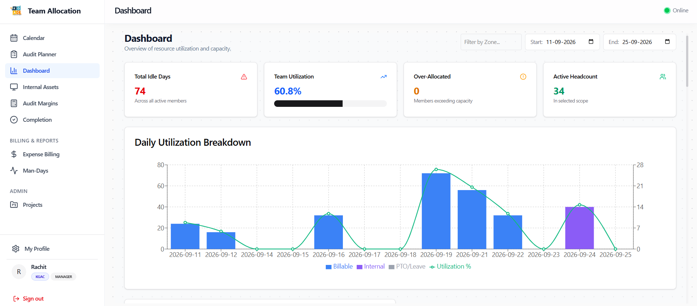

# Role Walkthrough Guide: Department Manager
## Operations & Team Leadership Manual

> [!NOTE]
> **Role Designation:** `manager` (Operations Manager / Department Head)  
> **Primary Purpose:** Cross-functional team supervision, capacity management, leave administration, department asset governance, and operational reporting.  
> **Supported Entities:** KGAC & KPL

---

## 1. Role Scope & Key Responsibilities

As a **Department Manager**, you hold operational oversight over your assigned department (e.g., *Operations*, *Engineering*, *Audit Support*). You ensure optimal resource utilization, timely leave processing, asset custody compliance, and project budget adherence.

### Summary of Responsibilities
1. **Capacity & Resource Allocation:** Balance workloads across department team members using the interactive calendar grid.
2. **Leave Management:** Act as the primary approver for team vacation, sick, and personal leave requests.
3. **Department Asset Custody:** Authorize equipment checkouts, verify physical condition upon return, and confirm returns to clear employee liability.
4. **Project Administration:** Configure department projects, assign team members, and designate billable vs non-billable codes.
5. **Timesheet Governance:** Enforce 100% weekly timesheet completion and resolve idle days.
6. **Operational Analytics & Exports:** Monitor utilization charts and export department records in CSV and Excel formats.

---

## 2. System Access & Navigation Overview

| Navigation Item | Route | Key Purpose |
| :--- | :--- | :--- |
| **Calendar** | `/calendar` | Department-wide allocation grid with bulk copy and quick-fill tools. |
| **Audit Planner** | `/planner` | Multi-team schedule builder and resource capacity balancing. |
| **Dashboard** | `/dashboard` | Department utilization charts, idle days table, and overdue asset alerts. |
| **Internal Assets** | `/assets` | Borrow approvals, physical return confirmations, and department history exports. |
| **Audit Margins** | `/reconciliation` | Margin reconciliation and project cost analysis. |
| **Completion** | `/completion` | Team timesheet compliance tracker (Missing, Submitted, Mismatch). |
| **Expense Billing** | `/billing` | Review reimbursable project expenses and contractor billing. |
| **Man-Days** | `/man-days` | Billable vs non-billable man-day breakdown. |
| **Projects** | `/admin/projects` | Create projects, assign codes, colors, and configure team members. |

---

## 3. Step-by-Step Operating Procedures

### 3.1 Managing Department Workload on Calendar
1. Navigate to **Calendar** (`/calendar`).
2. Filter the view by your Department name.
3. Review team rows for:
   - **Over-allocation:** Highlighted in amber when daily hours exceed 8 hours.
   - **Under-allocation (Idle Days):** Highlighted in red (`IDLE`).
4. To assign staff to ongoing engagements, click on any empty cell, select the project, enter 8 hours, and save.
5. Use **Copy Previous Week** to roll forward standard schedules.

---

### 3.2 Reviewing & Approving Department Leaves
1. Access the **Leave Approvals** queue.
2. View pending requests submitted by department staff.
3. Inspect the employee's historical leave balance and current project commitments.
4. Click **Approve** or **Reject**. The decision instantly updates the employee's calendar and sends a notification.

---

### 3.3 Equipment Custody & Return Verification
1. Open **Internal Assets** (`/assets`).
2. Under **Pending Approvals**, review gear checkout requests from your staff. Click **Approve**.
3. When an employee returns gear:
   - Receive the physical device in the office.
   - Inspect screen, casing, battery, and accessories.
   - Go to **Pending Approvals** tab.
   - Click **Confirm Return** on the employee's return request.
   - The asset is immediately marked `Available` in the central inventory.

---

### 3.4 Monitoring Idle Days & Timesheet Completion
1. Review the **Idle Days Table** on the Dashboard (`/dashboard`).
2. Team members with unallocated workdays will be listed alongside their idle hours.
3. Navigate to **Completion** (`/completion`) to review the submission status of all department members before weekly payroll cutoff.
4. Export the completion report in Excel or CSV to follow up on outstanding timesheets.

---

### 3.5 Managing Department Projects
1. Navigate to **Projects** (`/admin/projects`).
2. Click **Create Project**.
3. Enter Project Name, unique Project Code (e.g., `MKTG-2026`, `OPS-MAINT`), and choose a identifying color.
4. Set whether the project is `Billable` or `Internal`.
5. Open the **Project Team Modal** to restrict project allocation to specific department members.

---

## 4. Managerial Best Practices Checklist

- [ ] **Monday Planning:** Review the weekly schedule every Monday morning to eliminate idle gaps.
- [ ] **Prompt Leave Processing:** Approve or reject leave applications within 24 hours of submission.
- [ ] **Asset Return Discipline:** Never confirm an asset return in the software without physical inspection of the hardware.
- [ ] **Department Payroll Sign-off:** Sign off on timesheets every Friday by 5 PM.
