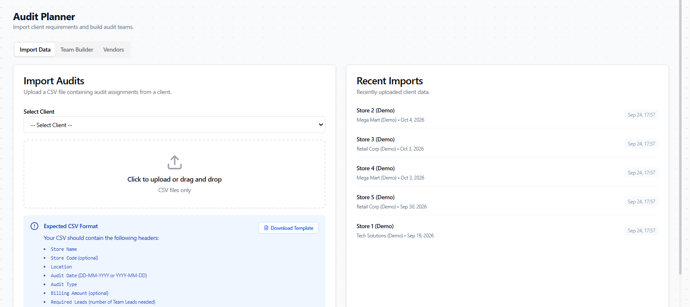
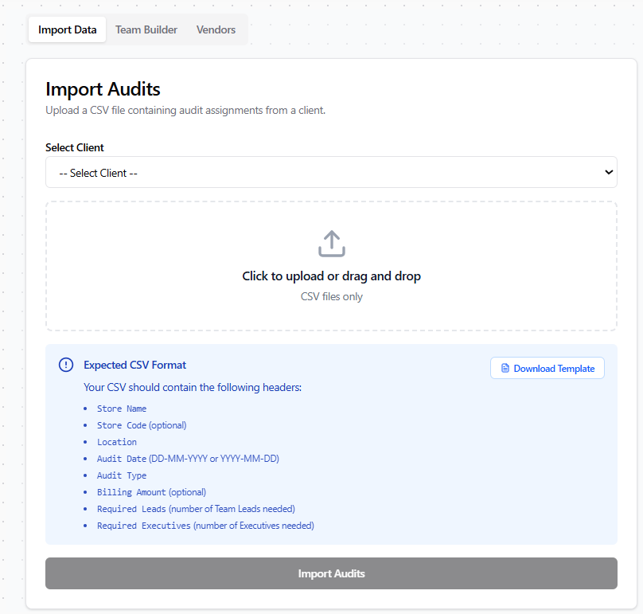
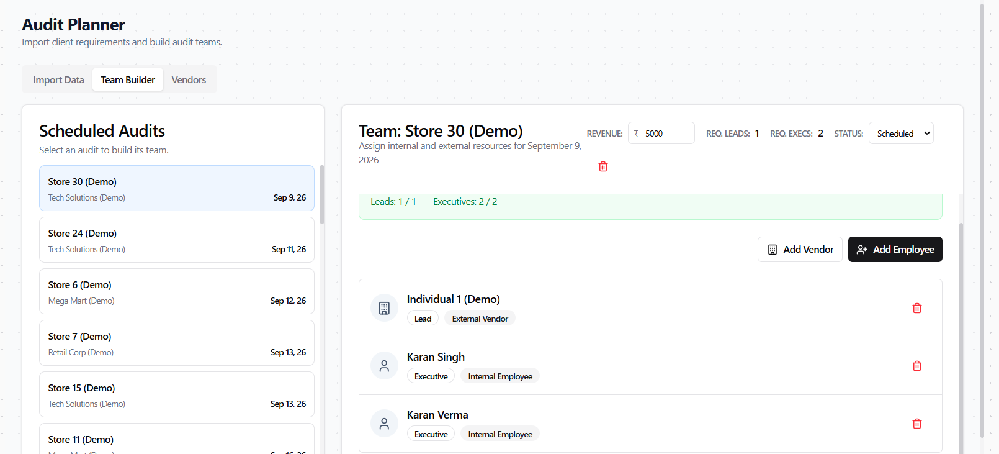

# Role Walkthrough Guide: Audit Planner
## Audit Scheduling & Resource Planning Manual

> [!NOTE]
> **Role Designation:** `planner` (Audit Planner & Resource Scheduler)  
> **Primary Purpose:** Client audit schedule intake, auditor team construction, double-booking prevention, vendor contractor allocation, and schedule publishing.  
> **Supported Entities:** KGAC & KPL

---

## 1. Role Scope & Key Responsibilities

As an **Audit Planner**, you are the scheduling architect of the organization. You take high-volume client audit schedules (e.g. hundreds of retail stores across India) and translate them into actionable, conflict-free team assignments.

### Summary of Responsibilities
1. **Client CSV Import:** Ingest multi-store audit schedules from client spreadsheets into the Audit Planner.
2. **Team Building & Staffing:** Assemble qualified audit teams (Audit Executive Lead + Field Auditors + External Contractors) for every store.
3. **Double-Booking Prevention:** Utilize platform conflict detection to prevent scheduling the same auditor in two locations simultaneously.
4. **Vendor Contractor Sourcing:** Allocate approved external contractors to stores where internal headcount is unavailable.
5. **Timeline Governance:** Monitor audit start dates, duration, and completion statuses across all active client accounts.

---

## 2. System Access & Navigation Overview

| Navigation Item | Route | Key Purpose |
| :--- | :--- | :--- |
| **Audit Planner** | `/planner` | Master scheduling engine: CSV import, team builder, conflict detection. |
| **Calendar** | `/calendar` | Cross-check auditor availability and leave commitments. |
| **Dashboard** | `/dashboard` | View upcoming audit milestones and platform-wide schedule health. |
| **Internal Assets** | `/assets` | Check equipment availability for upcoming high-volume audit waves. |
| **My Profile** | `/profile` | Account settings, entity designation, and security. |

---

## 3. Step-by-Step Operating Procedures

### 3.1 Authentication, Registration & Onboarding
Audit Planners access the scheduling engine via:
- **Sign In with Google:** Click **"Sign in with Google"** with your authorized company email.
- **Username & Password:** Click **"Username & Password"**, enter username (without domain) and password.
- **Create Account (New Planners):** Register via **"Don't have an account? Sign up"**. Newly registered accounts display **Account Pending Approval** until assigned the `planner` role by an Administrator.
- **Entity Confirmation:** Confirm **KGAC** or **KPL** on first login.

---

### 3.2 Ingesting Client Schedules via CSV Import
1. Navigate to **Audit Planner** (`/planner`).
2. Click **Import Client Schedule (CSV)**.
3. In the upload dialog:
   - Select the target **Client** (e.g., *Reliance Retail*, *Tata Croma*).
   - Drag and drop or browse for the client schedule `.csv` file.
4. The system validates required columns:
   - `Store Code` / `Store Name`
   - `Location` / `City` / `Zone`
   - `Start Date` & `End Date`
   - `Required Auditors` count
5. Review the preview table for format errors.
6. Click **Import & Generate Audits**. The stores populate the Planner pipeline immediately.

---

### 3.2 Building Audit Teams & Conflict Prevention
1. In the Planner view, select an unassigned or partially assigned store audit.
2. Click **Build Team**.
3. In the **Team Builder Modal**:
   - **Audit Executive (Lead):** Select a qualified senior auditor from the dropdown.
   - **Auditors:** Add required number of internal staff.
   - **External Contractors:** If internal staff is constrained, select from approved vendor contractors.
4. **Intelligent Conflict Guard:**
   - If a selected auditor is already scheduled on another store during the same date interval, the system flags the auditor in **Red** with a `CONFLICT: Double-Booked` warning.
   - If an auditor has an approved leave (`PTO`/`Sick`) on the dates, the system flags a `LEAVE CONFLICT`.
5. Resolve conflicts by reallocating alternate personnel.
6. Click **Confirm & Save Team**.

---

### 3.3 Managing Vendor Contractors in Audits
1. When store requirements exceed internal headcount, open the **Vendors** section in Team Builder.
2. Select an approved vendor agency.
3. Choose the contractor name. The platform automatically associates the contractor's negotiated daily billing rate for margin calculation.
4. Confirm allocation. The contractor appears on the roster with an external badge.

---

### 3.4 Publishing Schedules to Field Teams
1. Once team staffing is finalized for an audit wave, click **Publish Allocations**.
2. This action:
   - Automatically populates each auditor's personal **Calendar** with the assigned store project codes.
   - Activates the audit cards on the auditors' personal **Dashboard** under **Upcoming Audits**.
   - Notifies the Audit Manager of roster completion.

---

## 4. Planner Quality Standards Checklist

- [ ] **7-Day Advance Staffing:** Finalize store rosters at least 7 days before audit kickoff to allow travel coordination.
- [ ] **Zero Double-Bookings:** Never bypass a red conflict flag without explicit manager approval.
- [ ] **Lead Coverage:** Ensure 100% of multi-person audits have at least one designated `audit_executive` or senior lead.
- [ ] **Hardware Capacity Check:** Review Internal Assets before scheduling large concurrent store waves.
