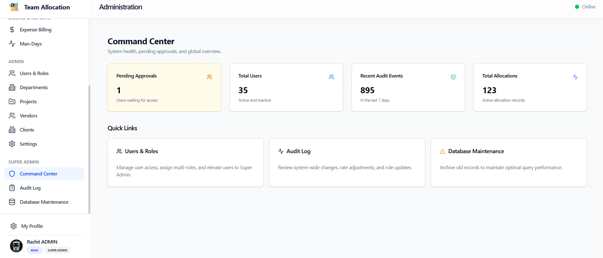
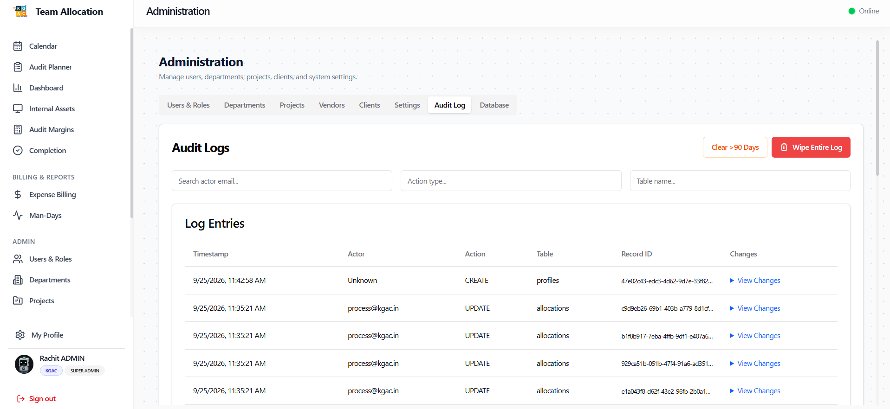
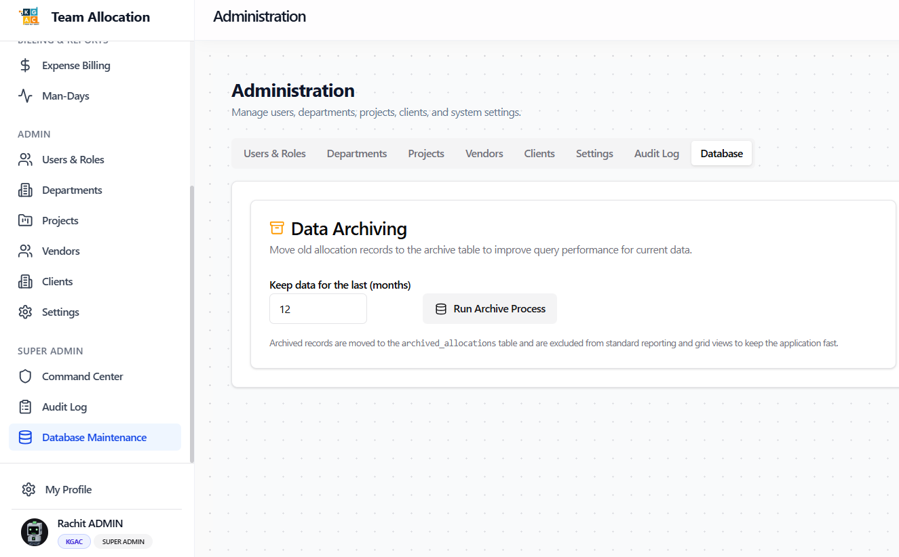

# Role Walkthrough Guide: Super Administrator
## Platform Governance & Infrastructure Command Manual

> [!NOTE]
> **Role Designation:** `super_admin` (Super Administrator / Platform Owner)  
> **Primary Purpose:** Enterprise platform governance, command center telemetry, security audit trail inspection, database maintenance, and security role alignment.  
> **Supported Entities:** KGAC & KPL (Global Platform Scope)

---

## 1. Role Scope & Key Responsibilities

As the **Super Administrator**, you hold the highest echelon of security clearance and administrative authority within the KGAC platform. You oversee system integrity, operational telemetry, database hygiene, and security audit logs across both KGAC and KPL entities.

### Summary of Responsibilities
1. **Executive Command Center:** Monitor platform health, active user concurrency, data throughput, and high-level operations.
2. **Security Audit Log Forensics:** Inspect end-to-end audit trails of all system events, role changes, data modifications, and approvals.
3. **Database Maintenance & Performance:** Execute database maintenance routines, cache clearing, connection health checks, and historical record archiving.
4. **Role Alignment & Elevation:** Authorize and delegate administrative privileges (`admin`, `super_admin`) with strict security governance.
5. **System-wide Policy & Disaster Recovery:** Oversee emergency operations, data backups, and multi-tenant entity segregation.

---

## 2. System Access & Navigation Overview

Super Administrators possess unrestricted access across the entire platform, including specialized executive sections:

| Navigation Item | Route | Key Purpose |
| :--- | :--- | :--- |
| **Command Center** | `/admin/command-center` | Executive platform telemetry, real-time metrics, system health. |
| **Audit Log** | `/admin/audit-log` | Comprehensive audit trail: logons, edits, role promotions, approvals. |
| **Database** | `/admin/database` | Database maintenance, table sizes, cache flush, archive tools. |
| **Role Alignment** | `/admin/roles` | High-privilege role assignment and permission matrix management. |
| **All Other Modules** | *Unrestricted* | Full administrative override across Calendar, Planner, Assets, Billing, Margins, Users. |

---

## 3. Step-by-Step Operating Procedures

### 3.1 Authentication, Access Elevation & Session Security
Super Administrators access the platform with top-tier security credentials:
- **Sign In with Google:** Authenticate using your primary corporate Google identity with 2-Factor Authentication enabled.
- **Username & Password:** Direct administrative login.
- **Create Account (New Super Admins):** When a new platform executive registers via **"Don't have an account? Sign up"**, their account initially sits in **Account Pending Approval**. An existing Super Administrator must elevate their permissions via **Role Alignment** (`/admin/roles`).
- **Entity Scope:** Super Admins hold dual-entity authority over both **KGAC** and **KPL**.

---

### 3.2 Operating the Super Admin Command Center
1. Navigate to **Command Center** (`/admin/command-center`).
2. Review real-time operational telemetry:
   - **Active Sessions:** Current authenticated users across KGAC and KPL.
   - **System Latency:** API response times and Supabase database connection pool health.
   - **Timesheet Compliance Rate:** Organization-wide percentage of allocated vs idle hours for the active week.
   - **Equipment Utilization Rate:** Active equipment in field vs available inventory.
3. Use the **Global System Broadcast** tool if emergency notifications or scheduled maintenance alerts need to be pushed to all connected browsers.

---

### 3.2 Conducting Security Investigations via Audit Log
Every critical system action is recorded immutably in the platform audit log.

1. Navigate to **Audit Log** (`/admin/audit-log`).
2. Search and filter logs using granular controls:
   - **Action Filter:** `ROLE_CHANGE`, `STATUS_CHANGE`, `CREATE`, `UPDATE`, `DELETE`, `LOGIN`, `APPROVAL`.
   - **User Filter:** Filter by specific admin or employee username.
   - **Date Interval:** Isolate exact incident hours.
3. Click on any log row to expand the **JSON State Diff**:
   - Compare `previous_state` vs `new_state` to verify exact data modifications (e.g., changes to project billing rates or role promotions).
4. Export forensic audit logs via **Export as Excel** or **Export as CSV** for external compliance reviews.

---

### 3.3 Database Maintenance & Performance Optimization
1. Navigate to **Database Maintenance** (`/admin/database`).
2. Review table row counts and disk space consumption for:
   - `allocations`
   - `audit_logs`
   - `assets` & `asset_transactions`
   - `planner_audits`
3. Maintenance Routines:
   - **Cache Flush:** Click **Clear Redis/Application Cache** to refresh stale metadata across client browsers.
   - **Optimize Tables:** Run table analysis to refresh database query planner statistics.
   - **Historical Archiving:** Archive audit data older than 2 years to cold storage to ensure ongoing UI speed.

---

### 3.4 High-Level Role Alignment & Privilege Elevation
1. Navigate to **Role Alignment** (`/admin/roles`).
2. Review all accounts possessing elevated permissions (`admin`, `super_admin`).
3. To elevate a user to Administrator or Super Administrator:
   - Locate the user.
   - Open the **Role Assignment Dialog**.
   - Select the target elevated role.
   - Provide an mandatory authorization justification note for the audit log.
   - Confirm with dual-check verification.

---

## 4. Super Admin Security & Governance Protocol

- [ ] **Dual-Admin Principle:** Maintain at least two designated Super Admin accounts to prevent lockout, but no more than three.
- [ ] **Weekly Audit Trail Review:** Review all `ROLE_CHANGE` and `STATUS_CHANGE` actions logged during the preceding 7 days.
- [ ] **Data Integrity Verification:** Confirm database backup snapshots prior to any bulk table maintenance.
- [ ] **Zero Shared Accounts:** Super Admin accounts must be tied to verified individuals; generic "admin@kgac.in" logins are strictly prohibited.
